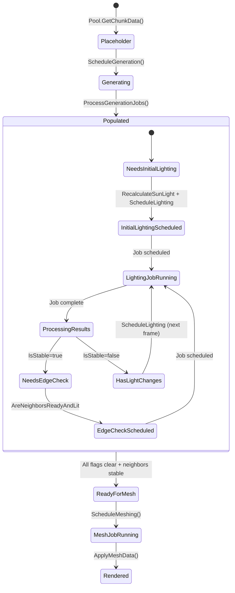
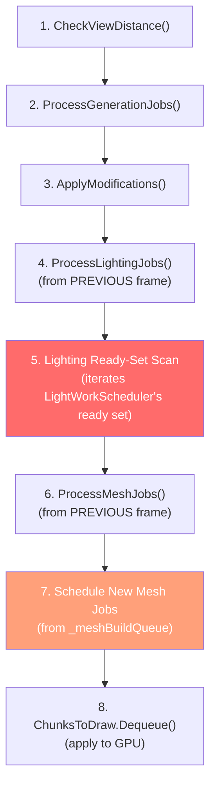
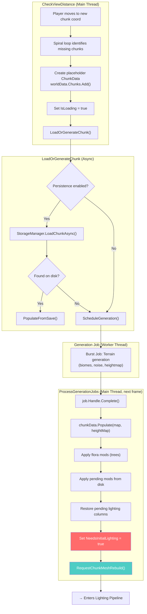
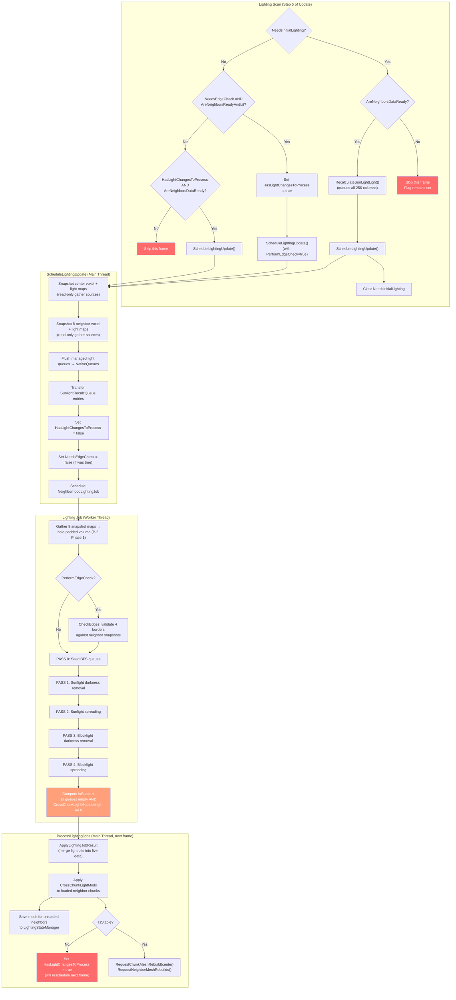
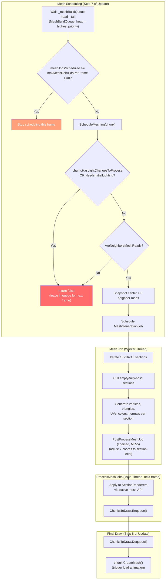
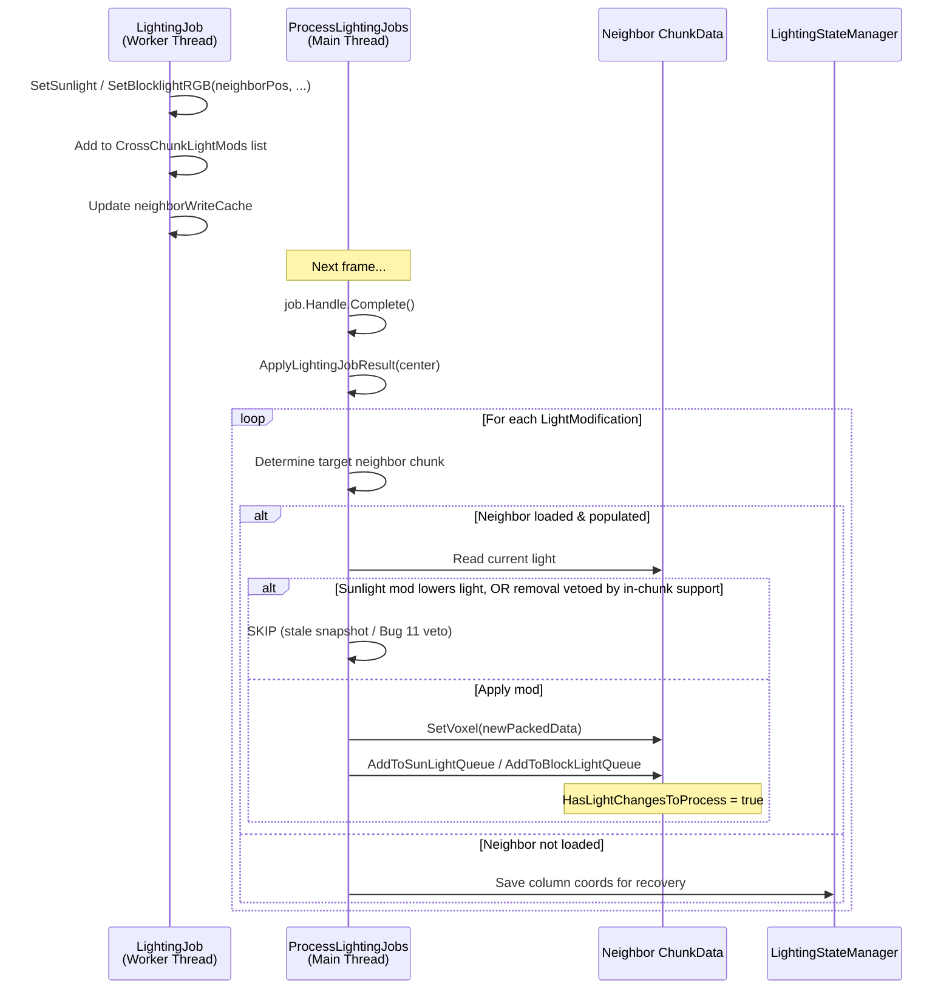
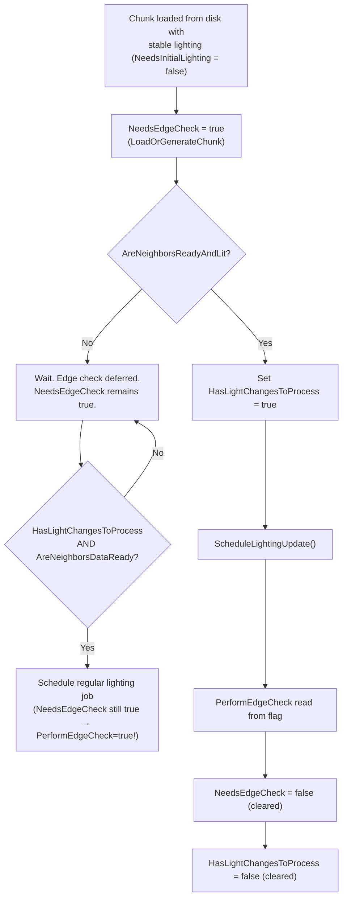
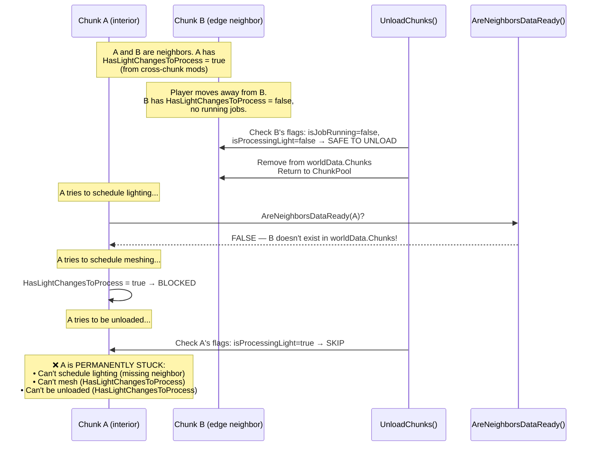

# Chunk Lifecycle Pipeline: Generation → Lighting → Meshing

**Status:** Living Document  
**Last Updated:** June 2026  
**Purpose:** Comprehensive reference for how a chunk transitions from empty placeholder to rendered mesh, with all state flags, readiness gates, and inter-system dependencies fully mapped.

---

## 1. Executive Summary

The chunk lifecycle is a multi-stage, asynchronous pipeline orchestrated by **`World.Update()`** on the main thread. Each stage hands off work to the Unity Job System (Burst-compiled background threads) and processes results in subsequent frames.
The pipeline has three primary stages:

1. **Generation** — Produces terrain voxel data (block IDs, heightmap).
2. **Lighting** — Calculates sunlight and blocklight via BFS flood-fill.
3. **Meshing** — Builds renderable mesh geometry from lit voxel data.

Each stage is gated by **readiness checks** on the chunk and its neighbors. A chunk cannot advance to the next stage until all prerequisites are met. The system is designed to converge — light values are bounded (0–15),
BFS is deterministic — but edge cases in scheduling order, throttling, and cross-chunk dependencies can delay convergence under load.

---

## 2. State Flags Reference

Each `ChunkData` instance carries the following transient flags that control pipeline progression:

| Flag                          | Type | Set By                                                                                                                              | Cleared By                                                | Purpose                                                                                                               |
|-------------------------------|------|-------------------------------------------------------------------------------------------------------------------------------------|-----------------------------------------------------------|-----------------------------------------------------------------------------------------------------------------------|
| `IsPopulated`                 | bool | `Populate()` / `PopulateFromSave()`                                                                                                 | `Reset()` (pool recycle)                                  | Voxel data exists and is valid                                                                                        |
| `IsLoading`                   | bool | `CheckViewDistance()`                                                                                                               | Never explicitly cleared (reset on pool recycle)          | Prevents duplicate disk load requests                                                                                 |
| `NeedsInitialLighting`        | bool | `ProcessGenerationJobs()` / `PopulateFromSave()`                                                                                    | `Update()` lighting scan after scheduling initial pass    | Chunk has terrain but no lighting yet                                                                                 |
| `HasLightChangesToProcess`    | bool | `AddToSunLightQueue()`, `AddToBlockLightQueue()`, cross-chunk mods, edge check scheduling                                           | `ScheduleLightingUpdate()`                                | Pending light changes in managed queues                                                                               |
| `NeedsEdgeCheck`              | bool | Post-stabilization re-arm (`ProcessLightingJobs`), neighbor propagation, or disk load                                               | `ScheduleLightingUpdate()`                                | Border voxels need validation against neighbors                                                                       |
| `IsAwaitingMainThreadProcess` | bool | Per-job merge start (`MergeCompletedLightingJob`)                                                                                   | `ProcessLightingJobs()` per-job `finally` (even on fault) | Lighting job completed, cross-chunk mods being applied                                                                |
| `RemainingEdgeCheckRounds`    | int  | Initialized to 2 on `ChunkData`; reset to 2 by `Reset()`; re-granted to 1 by `ModifyVoxel` on a border-column opacity edit (Bug 05) | Decremented in `ProcessLightingJobs()` per stable pass    | Iterative edge-check rounds still to re-arm after a stable lighting pass (cross-seam convergence). `[NonSerialized]`. |

### Flag Lifecycle Diagram



---

## 3. Readiness Gates

Two critical gate functions control when work can proceed. Understanding the difference between them is essential for diagnosing pipeline stalls.

### 3.1 `AreNeighborsDataReady(ChunkCoord)`

**Used by:** Initial lighting scheduling, regular lighting scheduling (fallback path).

Checks all **8 horizontal neighbors** (cardinal + diagonal):

| Check          | Condition                              | Rationale                                                                                                                                                                                                                    |
|----------------|----------------------------------------|------------------------------------------------------------------------------------------------------------------------------------------------------------------------------------------------------------------------------|
| World bounds   | `IsChunkInWorld()` → skip if false     | WS-3: `IsChunkInWorld` is now always true (XZ fully unbounded, both signs), so this skip branch never fires — every neighbor is an ordinary frontier chunk that parks until populated. "Out-of-world" no longer exists in XZ |
| Generation job | `generationJobs.ContainsKey()` → false | Neighbor terrain must be complete                                                                                                                                                                                            |
| Data exists    | `Chunks.TryGetValue()` → exists        | Neighbor must have a ChunkData                                                                                                                                                                                               |
| Populated      | `IsPopulated` → true                   | Voxel data must be filled                                                                                                                                                                                                    |

**Summary:** "Do all neighbors have terrain data I can read?"

### 3.2 `AreNeighborsReadyAndLit(ChunkCoord)`

**Used by:** Edge check scheduling. (Mesh scheduling formerly used this gate; it now uses the relaxed `AreNeighborsMeshReady` — see §3.3 and §9.3.)

Checks all **8 horizontal neighbors** (cardinal + diagonal) with stricter requirements:

| Check                          | Condition                             | Rationale                                   |
|--------------------------------|---------------------------------------|---------------------------------------------|
| All of `AreNeighborsDataReady` | (see above)                           | Baseline requirement                        |
| Lighting job                   | `lightingJobs.ContainsKey()` → false  | Neighbor must not be computing light        |
| Pending light changes          | `HasLightChangesToProcess` → false    | Neighbor must not have unscheduled work     |
| Initial lighting               | `NeedsInitialLighting` → false        | Neighbor must have completed first lighting |
| Main-thread processing         | `IsAwaitingMainThreadProcess` → false | Neighbor must not be in transitional state  |

**Summary:** "Are all neighbors fully generated AND lighting-stable?"

### 3.3 `AreNeighborsMeshReady(ChunkCoord)` *(NEW)*

**Used by:** Mesh scheduling (via `ScheduleMeshing`).

Checks all **8 horizontal neighbors** (cardinal + diagonal) with relaxed requirements:

| Check                   | Condition                              | Rationale                                                                                                                                   |
|-------------------------|----------------------------------------|---------------------------------------------------------------------------------------------------------------------------------------------|
| World bounds            | `IsChunkInWorld()` → skip if false     | WS-3: `IsChunkInWorld` is now always true (XZ fully unbounded) — this skip branch never fires; every neighbor is an ordinary frontier chunk |
| Generation job          | `generationJobs.ContainsKey()` → false | Neighbor terrain must be complete                                                                                                           |
| Data exists + populated | `Chunks.TryGetValue()` + `IsPopulated` | Neighbor must have voxel data                                                                                                               |
| Initial lighting done   | `NeedsInitialLighting` → false         | Neighbor must have had at least one lighting pass                                                                                           |

**Does NOT check:** `lightingJobs`, `HasLightChangesToProcess`, `IsAwaitingMainThreadProcess`.

**Summary:** "Do all neighbors have populated data with at least one lighting pass complete?"

> [!NOTE]
> This gate was introduced to break the wave-front ping-pong deadlock. Chunks at the loading edge continuously reschedule lighting jobs, which caused `AreNeighborsReadyAndLit` to perpetually return false for their neighbors.
> The relaxed gate allows meshing with "good enough" data; any stale border lighting is corrected by the automatic re-mesh triggered when the neighbor's lighting job completes.

> [!NOTE]
> ### `NeedsEdgeCheck` is not a readiness-gate input
> Neither `AreNeighborsReadyAndLit` nor `AreNeighborsMeshReady` checks `NeedsEdgeCheck` on neighbors, and `ScheduleMeshing` does not check it on the center chunk. This means:
> - A neighbor with `NeedsEdgeCheck = true` does NOT block meshing or edge-check scheduling of the center chunk.
> - A chunk can be meshed before its own edge check runs — `NeedsEdgeCheck` is effectively "invisible" to the readiness gates.
>
> This is intentional: edge checks are quality corrections, not correctness blockers. Any border light they add triggers an automatic re-mesh. See `LIGHTING_SYSTEM_OVERVIEW.md` §3.5.

---

## 4. The Main Loop (`World.Update()`)

Every frame, `Update()` executes the following steps in order. Understanding this sequence is critical because **order determines which chunks get served first**.



### Per-job fault isolation in the three job passes (HF-2)

All three completed-job sweeps (`ProcessGenerationJobs`, `ProcessLightingJobs`, `ProcessMeshJobs`)
release each job's containers *inside* the loop and remove the dictionary entries only *after* it.
Before HF-2, one exception mid-pass aborted the sweep and stranded already-released jobs in the
dictionary — every later frame re-touched their disposed containers, spamming
`ObjectDisposedException` and burying the original thrower. Each pass now isolates faults per job:

- **`Handle.Complete()` throws** → the job may still own its buffers, so nothing is released; the
  entry stays enrolled and is retried (isolated again) next pass.
- **Post-`Complete()` processing throws** → one `Debug.LogError` (errors are the regression signal),
  the job's containers are still released and the entry enrolled for removal, and the pass continues.
  Per pass: lighting re-flags the chunk (`HasLightChangesToProcess = true`, stability unknown → a
  corrective pass runs) and counts the fault in `WorldJobManager.LastFaultedLightJobs`; generation
  releases only if the happy path had not (its budget-retry `continue` paths intentionally keep jobs
  un-released across frames); meshing returns the buffers in a `finally` and the chunk keeps its
  previous mesh.
- **Flag pairing holds on fault:** the lighting pass clears `IsAwaitingMainThreadProcess` in a
  per-job `finally`, so a faulted merge cannot park its chunk forever.

Recovery is deliberately *not* promised (a faulted generation job can leave its chunk unpopulated,
loudly) — the isolation exists to keep one fault from cascading into the whole pass, not to hide it.

The **lighting** pass's loop structure — iterate → complete → merge → release-inside-loop → enroll →
remove-after-loop → promote-after, with the two-stage fault isolation above — is extracted into the
shared `Helpers/LightingCompletionPass.cs` (`RunMergeLoop` + `RunRemoveAndPromote`, driven through
`ILightingCompletionDriver<TKey>`). `ProcessLightingJobs` implements the driver on `this`; the editor
frame simulator implements it too, so the harness replays the exact same pass bookkeeping and can inject
a merge fault to prove the isolation mechanically (baseline B65). This is the completion-pass twin of the
scheduling-side `LightingScanDecision` (§ shared arm decision) — HF-4.

### Step 5: Lighting Ready-Set Scan (The Critical Section)

This is where most pipeline stalls originate. The dirty set lives in `LightWorkScheduler` (`Assets/Scripts/Helpers/LightWorkScheduler.cs`, MT-2), split into two `HashSet<Vector2Int>`s of chunks whose lighting flags (`NeedsInitialLighting`, `HasLightChangesToProcess`, `NeedsEdgeCheck`) have been set to `true`:

- **Ready** — visited by the per-frame scan.
- **Waiting** — parked chunks whose readiness gate failed (or whose lighting job is in-flight); invisible to the scan until a promotion event moves them back. This keeps the per-frame cost at O(schedulable) instead of O(dirty) — under a backlog, blocked chunks no longer pay 8-neighbor gate evaluations every frame.

**Registration:** The three lighting flags on `ChunkData` are properties with setters. When any flag transitions to `true`, a static callback (`ChunkData.OnLightWorkFlagged` → `LightWorkScheduler.Flag`) enqueues the chunk's position into a `ConcurrentQueue<Vector2Int>` — this is thread-safe and supports flag-setting from background deserialization threads (`ChunkSerializer.ReadChunkInternal` via `Task.Run`). The main thread drains this queue into the ready set at the start of the scan (promoting parked entries).

**Demotion (parking):** A visited ready chunk is moved to waiting when it cannot make progress: it is unpopulated, its lighting job is still in-flight, or its flags remain set but no branch could schedule (a readiness gate failed).

**Promotion:** A parked chunk re-enters the ready set on exactly the events that can flip its gate (`PromoteNeighborhood` promotes the parked entries of a 3×3 neighborhood, move-only):

1. **Terrain generation completed** — the completed-job sweep in `ProcessGenerationJobs` (the `GenerationJobs.Remove` is what flips `AreNeighborsDataReady` for the 8 neighbors).
2. **Disk load hydrated** — after `PopulateFromSave` in `LoadOrGenerateChunk` (same gate, load path).
3. **Lighting job completed** — the completed-job sweep in `ProcessLightingJobs` (the last event in an `AreNeighborsReadyAndLit` unblock chain, and what un-parks a chunk re-flagged mid-flight).
4. **Own flag transition** — `Flag` → staging drain (covers e.g. cross-chunk mods landing on a parked chunk).

**Fail-safe:** Every ~1 second (`FULL_LIGHT_SCAN_SECONDS`), a full scan of `worldData.Chunks.Values` runs to catch any chunks that were missed by the callback (e.g., flags set before the callback was registered), and `PromoteAll` moves the entire waiting set back to ready. This prevents permanent stalls: a missed promotion event degrades to ≤1 s of latency, never a deadlock. With `enableDiagnosticLogs`, a recurring non-zero fail-safe promotion count is logged — it means an unblock event lacks a promotion hook.

**Self-cleaning:** When the scan encounters a position whose chunk was unloaded (`TryGetValue` returns false), the stale entry is removed from both sets automatically. When a chunk's flags are all clear after processing, it is also removed.

**Shared arm decision:** The per-chunk arm selection below (initial vs. edge vs. regular vs. remove vs. park) is the pure function `LightingScanDecision.EvaluateReadyChunk` (`Assets/Scripts/Helpers/LightingScanDecision.cs`). Both `World.Update`'s scan and the editor `LightingFrameSimulator`'s scheduler mode call it, so the live pipeline and its validation harness can never disagree on which arm a ready chunk takes (the shared-guard pattern of `LightingScheduleDecision`; roadmap AS-2 / HF-4). The pseudocode below is that function's logic inlined for
readability.

```
// Drain thread-safe staging queue into main-thread ready set (promotes parked entries):
_lightWork.DrainStaging()

// Fail-safe full scan (every ~1 second):
foreach chunkData in worldData.Chunks.Values:
    if populated AND any lighting flag set:
        _lightWork.AddReady(position)
_lightWork.PromoteAll()                                       ← waiting → ready backstop

// Ready-set iteration (waiting set is NOT visited):
snapshot = ListPool.Get(_lightWork ready set)
foreach pos in snapshot:
    if lightJobsScheduled >= maxLightJobsPerFrame (32): BREAK  ← throttle (rest stays ready)
    if !worldData.Chunks.TryGetValue(pos): REMOVE, SKIP        ← self-clean (both sets)
    if !chunkData.IsPopulated: PARK, SKIP                      ← promoted on population
    if lightingJobs.ContainsKey(coord): PARK, SKIP             ← promoted on job completion

    if chunkData.NeedsInitialLighting:
        if AreNeighborsDataReady(coord):
            RecalculateSunLightLight()
            ScheduleLightingUpdate()        ← clears NeedsInitialLighting
            lightJobsScheduled++
    else:
        scheduled = false

        // Edge check path (strict gate)
        if chunkData.NeedsEdgeCheck AND AreNeighborsReadyAndLit(coord):
            chunkData.HasLightChangesToProcess = true  ← SET before schedule
            scheduled = ScheduleLightingUpdate()       ← clears NeedsEdgeCheck + HasLight...

        // Regular lighting path (relaxed gate)
        if !scheduled AND chunkData.HasLightChangesToProcess AND AreNeighborsDataReady(coord):
            scheduled = ScheduleLightingUpdate()       ← clears HasLight...

        if scheduled: lightJobsScheduled++

    // Remove if all flags are clear; otherwise PARK if nothing was scheduled (gate failed)
    if !NeedsInitialLighting AND !HasLightChangesToProcess AND !NeedsEdgeCheck:
        _lightWork.Remove(pos)
    else if nothing scheduled this visit:
        _lightWork.MarkWaiting(pos)                            ← promoted by events above
```

> [!IMPORTANT]
> ### Critical Scheduling Detail
> When the edge-check path in the lighting scan sets `HasLightChangesToProcess = true` but `ScheduleLightingUpdate()` returns `false` (e.g., job already exists — shouldn't happen due to the earlier `lightingJobs.ContainsKey` guard), the flag would remain set and fall through to the regular path.
> However, because `ScheduleLightingUpdate` reads `NeedsEdgeCheck` internally and clears it, the **fallback path effectively performs the edge check anyway**, but under the weaker `AreNeighborsDataReady` gate instead of `AreNeighborsReadyAndLit`.

---

## 5. Full Pipeline Flowchart

### 5.1 New Chunk (Generation Path)



### 5.2 Lighting Pipeline



### 5.3 Meshing Pipeline



---

## 6. Cross-Chunk Modification Flow

When a lighting job produces changes that affect neighbor chunks, the modifications follow this specific path:



### Cross-Chunk Sunlight Guard Logic

`ProcessLightingJobs` routes every cross-chunk mod through `LightingJobProcessor.RouteCrossChunkMod` (drop / persist / defer / apply), then applies the per-voxel decision via `CrossChunkLightModApplier.ComputeSunlight` — shared with the editor lighting validation suite. Three rules guard sunlight, all evaluated against the neighbor's **current** value:

1. **Only-increase guard:** If `mod.LightLevel > 0 AND mod.LightLevel < currentSunlight` → skip (and an equal value is a no-op). Cross-chunk mods are computed against a stale schedule-time snapshot, so they may only **raise** sunlight; the neighbor's own column recalculation owns decreases.

2. **Bug 11 in-chunk-support veto:** A removal (`mod.LightLevel == 0`) is skipped when a voxel *inside the receiving chunk* still independently supports the current value (`CrossChunkLightModApplier.InChunkSunlightSupport ≥ currentSunlight`). Support is attenuated by the target voxel's own opacity via `LightAttenuation.Attenuate`, and fully-opaque neighbors (which cannot propagate sky light) are excluded. Without this, two adjacent chunks that removed each other's shared seam column against stale snapshots oscillate forever (the reloaded-world stall).
   See baselines B48/B49 and `LIGHTING_SYSTEM_OVERVIEW.md` §3.7.

3. **Genuine darkness (level=0, unsupported):** Applied. These are critical for block removal/placement to propagate shadow correctly across borders.

---

## 7. `NeedsEdgeCheck` Lifecycle Deep-Dive

The edge check system was added to correct light inconsistencies at chunk borders caused by load-order dependencies. Here is the complete lifecycle:



> [!NOTE]
> ### When is NeedsEdgeCheck set?
> There are three set sites (plus one indirect trigger):
> 1. **Disk load** — `LoadOrGenerateChunk` sets `NeedsEdgeCheck = true` for chunks loaded with stable lighting (may have stale border lighting from a previous session).
> 2. **Post-stabilization re-arm (iterative rounds)** — `ProcessLightingJobs` re-arms `NeedsEdgeCheck` (+ `HasLightChangesToProcess`) on a chunk each time its lighting job reports `IsStable`, as long as `RemainingEdgeCheckRounds > 0` (default 2). This is what gives **freshly generated** chunks their edge checks — they get them after their initial lighting stabilizes, not when `NeedsInitialLighting` clears.
> 3. **Neighbor propagation** — when a chunk re-arms in (2) it also calls `TriggerNeighborEdgeChecks`, setting `NeedsEdgeCheck` on its 4 cardinal neighbors that are populated and past initial lighting.
>
> *Indirect (Bug 05 fix):* a **border-column opacity edit** does not set `NeedsEdgeCheck` directly — it re-grants `RemainingEdgeCheckRounds` (to 1) in `ModifyVoxel`, so the *next* stable pass re-arms via site (2). This gives a post-generation edit its reconciling border check even after generation spent the original 2 rounds.
>
> Round 1 fixes the immediate frontier against the latest neighbor data; round 2 reconciles the remainder after neighbors have run their own edge checks. The counter is `[NonSerialized]` and reset to 2 by `ChunkData.Reset()`.

> [!IMPORTANT]
> ### Edge Check Fallback Path
> When `NeedsEdgeCheck = true` but `AreNeighborsReadyAndLit` returns `false`, the dedicated edge-check path in the lighting scan does NOT fire.
> However, if the chunk ALSO has `HasLightChangesToProcess = true` (from cross-chunk mods or other sources), the **fallback regular-lighting path** fires with the weaker `AreNeighborsDataReady` gate.
> Since `ScheduleLightingUpdate` reads `chunkData.NeedsEdgeCheck` directly, the job **will** perform the edge check even though the strict gate wasn't satisfied. The flag is cleared regardless.
>
> This means edge checks can run with **potentially stale neighbor lighting data** — before neighbors have finished their own lighting passes. The edge check only ADDS light (never removes), which limits damage, but corrections may be incomplete.

---

## 8. `IsStable` — The Convergence Signal

A lighting job reports `IsStable = true` only when ALL of the following are true after the BFS completes (in `NeighborhoodLightingJob`):

1. Sunlight removal queue is empty
2. Sunlight placement queue is empty
3. Blocklight removal queue is empty
4. Blocklight placement queue is empty
5. **`CrossChunkLightMods.Length == 0`** ← This is the critical one

**Implication:** Initial lighting (which recalculates all 256 columns) almost always produces cross-chunk modifications at the borders, making `IsStable = false` on the first pass. This means:

- Every chunk requires **at least 2 lighting passes** after initial generation.
- The first pass produces cross-chunk mods.
- The second pass (if no new mods arrived from neighbors in the meantime) stabilizes.

When `IsStable = true`:

- A mesh rebuild is requested for the center chunk and its neighbors (`RequestChunkMeshRebuild` + `RequestNeighborMeshRebuilds`).
- If `RemainingEdgeCheckRounds > 0`, the counter is decremented and the chunk re-arms `NeedsEdgeCheck` + `HasLightChangesToProcess` on itself and `NeedsEdgeCheck` on its 4 cardinal neighbors (`TriggerNeighborEdgeChecks`). So a "stable" chunk normally still runs up to two more lighting passes for iterative border convergence (see §7).

When `IsStable = false`:

- `HasLightChangesToProcess = true` is set on the center chunk.
- No mesh rebuild is requested.
- The chunk re-enters the lighting scan next frame.

> [!NOTE]
> The stability test itself is computed only from the BFS queues + raw `CrossChunkLightMods.Length` inside the job. On the main thread, `LightingJobProcessor.IsEffectivelyStable` then overrides it to `true` when the only outstanding mods target out-of-world positions (which can never be consumed) — otherwise world-boundary chunks would reschedule lighting indefinitely. *(WS-3 note: with XZ fully unbounded, cross-chunk light mods — always horizontal, same Y — can no longer be out-of-world, so this override is effectively dead for XZ; undeliverable
frontier mods take the `PersistUndeliverable` route instead, which lets a frontier chunk settle exactly like any interior frontier.)*

---

## 9. Identified Risk Areas for Pipeline Stalls

### 9.1 Dictionary Iteration + Throttle Starvation

**Mechanism:** The lighting scan previously iterated `worldData.Chunks.Values` (a `Dictionary<Vector2Int, ChunkData>`). Dictionary iteration order is **non-deterministic** and may change when entries are added/removed.
Combined with the `maxLightJobsPerFrame = 32` throttle and the `break`, certain chunks could be consistently visited late in the iteration and starved if the throttle was exhausted by chunks visited earlier.

**Risk Level:** Low. ~~Medium~~.

**Status:** ✅ **MITIGATED** — The lighting scan now iterates a dirty set containing only chunks with pending work, instead of all loaded chunks. This drastically reduces iteration count during steady state (0–5 entries vs 625+). The `HashSet` iteration order is still non-deterministic, but with far fewer entries, throttle starvation is effectively eliminated. MT-2 further split the dirty set into ready/waiting subsets (`LightWorkScheduler`), so under a backlog the scan visits only schedulable chunks — gate-blocked chunks are parked and re-enter via
event-driven promotion (see Step 5).

### 9.2 Cross-Chunk Mod Ping-Pong

**Mechanism:** When chunk A's lighting job produces cross-chunk mods for neighbor B, B gets `HasLightChangesToProcess = true`. B then runs its lighting job, potentially producing mods back for A. This sets A's `HasLightChangesToProcess = true` again, preventing A from being
meshed (because `ScheduleMeshing` checks this flag on the center chunk).

**Convergence:** Light values are bounded 0-15 and the BFS is monotonic within a pass. The cross-chunk sunlight guard (only INCREASE allowed for non-zero mods) further constrains oscillation. This should converge in 2-3 rounds.

**Risk Level:** Low for isolated chunks. Medium when combined with continuous new chunk loading (see 9.3).

**Status:** ✅ **FIXED** — Removed `lightingJobs.ContainsKey(chunkCoord)` from the center chunk gate in `ScheduleMeshing`. The meshing job and lighting job now operate on independent snapshot copies of the voxel data, so they can safely run in parallel. Any stale lighting is automatically corrected by the subsequent `RequestChunkMeshRebuild` when the lighting job stabilizes.

### 9.3 Wave-Front Starvation (The Likely Deadlock Candidate)

**Mechanism:** When the player moves in one direction, a wave of new chunks enters the load distance:

1. New edge chunks generate terrain → `NeedsInitialLighting = true`
2. Initial lighting runs → produces cross-chunk mods for interior chunks
3. Interior chunks get `HasLightChangesToProcess = true`
4. Interior chunks can't mesh because `HasLightChangesToProcess` or `AreNeighborsReadyAndLit` fails
5. More new chunks arrive at the edge, producing MORE cross-chunk mods
6. Interior chunks' `HasLightChangesToProcess` keeps getting re-set before they can stabilize

This creates a **starvation cascade** where interior chunks are perpetually blocked by the wave of arriving edge chunks destabilizing their neighbors.

**Risk Level:** **HIGH** — matches the user-reported symptom of "large swathes of chunks not being meshed when loading from the same direction."

**Status:** ✅ **FIXED** — Replaced `AreNeighborsReadyAndLit` with `AreNeighborsMeshReady` in `ScheduleMeshing`. The relaxed gate allows meshing when neighbors have running lighting jobs, breaking the starvation cycle.
`DATA_LOAD_BUFFER` increased from 2 to 3 to ensure any transient stale-data artifacts are corrected in the invisible buffer zone before the chunk becomes visible.

### 9.4 Edge Check Gate Strictness

**Mechanism:** `NeedsEdgeCheck` requires `AreNeighborsReadyAndLit` to fire via the primary path. If neighbors are perpetually cycling through lighting passes (due to 9.3), the edge check never gets the strict gate satisfied. However, the fallback path (section 7) means the edge
check eventually fires with the weaker gate.

**Risk Level:** Low for correctness (fallback exists). But the fallback might run edge checks against stale data, producing suboptimal corrections.

### 9.5 Mesh Queue Population Race

**Mechanism:** `RequestChunkMeshRebuild` is called from multiple places:

- `ProcessGenerationJobs` (when chunk has a visual and completes generation)
- `ProcessLightingJobs` (when `IsStable = true`)
- `LoadOrGenerateChunk` (when loading from disk with stable lighting)
- `CheckViewDistance` (when activating a chunk that already has data)

If the chunk is not added to `_meshBuildQueue` (e.g., because `chunk.isActive` was false at the time, or the chunk wasn't in the `_chunkMap` yet), and no subsequent code path re-adds it, the chunk is **permanently orphaned** from the mesh queue.

**Risk Level:** Medium. The guards in `RequestChunkMeshRebuild` (`chunk == null || !chunk.IsActive`, plus `MeshBuildQueue.TryEnqueue`'s by-coordinate duplicate rejection) can filter out valid requests if timing is unfortunate.

### 9.6 Unload Stranding — Confirmed Deadlock Vector ⚠️

> [!CAUTION]
> This is the most dangerous identified risk and the **most likely root cause** of the observed deadlock. It creates a permanent stall that matches all reported symptoms.

**Mechanism:** When `UnloadChunks()` removes a chunk from memory, it only inspects the **chunk being unloaded** — it does NOT check whether removing it would strand a neighbor.

**Deadlock Sequence:**



**Key Code Path:**

```csharp
// UnloadChunks() — World.cs (original pre-fix logic; see Status below)
bool isJobRunning = JobManager.generationJobs.ContainsKey(chunkCoord)
                    || JobManager.meshJobs.ContainsKey(chunkCoord)
                    || JobManager.lightingJobs.ContainsKey(chunkCoord);

// ⚠️ Only checks the chunk BEING UNLOADED, not its neighbors!
bool isProcessingLight = data.IsAwaitingMainThreadProcess ||
                         data.HasLightChangesToProcess;

if (isJobRunning || isProcessingLight) continue; // Skip unload
```

**Why This Matches the Reported Symptoms:**

1. **"Large swathes of chunks not being meshed"** — Interior chunks whose edge-neighbors were unloaded are stuck with `HasLightChangesToProcess = true`.
2. **"Semi-reproducible when loading chunks from the same direction"** — Directional movement creates a leading edge that generates cross-chunk mods for interior chunks, then the trailing edge unloads, stranding them.
3. **"Fully unloading and reloading fixes the issue"** — When the stuck chunk is finally unloaded (e.g., player moves far away and eventually `HasLightChangesToProcess` is cleared via some path), or when returning to the area reloads the missing neighbor,
   the lighting can finally proceed.

**Risk Level:** **CRITICAL** — Creates a permanent, non-self-resolving deadlock under normal gameplay conditions.

**Status:** ✅ **FIXED** — `UnloadChunks()` now checks all 8 neighbors before unloading. If any neighbor has `HasLightChangesToProcess = true` or `NeedsInitialLighting = true`, the unload is deferred.

---

## 10. Key File Reference

| File                                                                                                                                                                                    | Role in Pipeline                                                                                                               |
|-----------------------------------------------------------------------------------------------------------------------------------------------------------------------------------------|--------------------------------------------------------------------------------------------------------------------------------|
| [World.cs](file:///k:/Documenten/Projects/Unity%20-%20Make%20Minecraft%20in%20Unity%203D%20Tutorial/Minecraft%20Clone/Assets/Scripts/World.cs)                                          | Main orchestrator: Update loop, CheckViewDistance, readiness gates, mesh queue                                                 |
| [WorldJobManager.cs](file:///k:/Documenten/Projects/Unity%20-%20Make%20Minecraft%20in%20Unity%203D%20Tutorial/Minecraft%20Clone/Assets/Scripts/WorldJobManager.cs)                      | Job scheduling & result processing for generation, lighting, meshing                                                           |
| [ChunkData.cs](file:///k:/Documenten/Projects/Unity%20-%20Make%20Minecraft%20in%20Unity%203D%20Tutorial/Minecraft%20Clone/Assets/Scripts/Data/ChunkData.cs)                             | State flags, light queues, voxel storage                                                                                       |
| [Chunk.cs](file:///k:/Documenten/Projects/Unity%20-%20Make%20Minecraft%20in%20Unity%203D%20Tutorial/Minecraft%20Clone/Assets/Scripts/Chunk.cs)                                          | Visual representation, mesh application, pool lifecycle                                                                        |
| [NeighborhoodLightingJob.cs](file:///k:/Documenten/Projects/Unity%20-%20Make%20Minecraft%20in%20Unity%203D%20Tutorial/Minecraft%20Clone/Assets/Scripts/Jobs/NeighborhoodLightingJob.cs) | BFS flood-fill, edge checking, IsStable computation                                                                            |
| `Assets/Scripts/Helpers/CrossChunkLightModApplier.cs`                                                                                                                                   | Per-voxel cross-chunk mod decision (sunlight guards, Bug 11 veto, wake-up nodes); shared with the validation suite             |
| `Assets/Scripts/Helpers/LightingJobProcessor.cs`                                                                                                                                        | Cross-chunk mod routing (drop/persist/defer/apply) + effective-stability override                                              |
| `Assets/Scripts/Helpers/LightingScheduleDecision.cs`                                                                                                                                    | Extracted `ScheduleLightingUpdate` guard logic (shared with frame-simulator tests)                                             |
| `Assets/Scripts/Helpers/LightingScanDecision.cs`                                                                                                                                        | Extracted ready-set scan arm decision (initial/edge/regular/remove/park; shared with frame-simulator tests)                    |
| `Assets/Scripts/Helpers/LightingCompletionPass.cs`                                                                                                                                      | Extracted completion-pass skeleton (merge loop + remove/promote, two-stage fault isolation; shared with frame-simulator tests) |
| `Assets/Scripts/Helpers/LightWorkScheduler.cs`                                                                                                                                          | MT-2 dirty-set bookkeeping: ready/waiting split, staging queue, event-driven promotion (own validation suite)                  |
| [SettingsManager.cs](file:///k:/Documenten/Projects/Unity%20-%20Make%20Minecraft%20in%20Unity%203D%20Tutorial/Minecraft%20Clone/Assets/Scripts/SettingsManager.cs)                      | `maxLightJobsPerFrame` (32), `maxMeshRebuildsPerFrame` (10)                                                                    |

---

## 11. Glossary

| Term                | Definition                                                                                                                                  |
|---------------------|---------------------------------------------------------------------------------------------------------------------------------------------|
| **BFS**             | Breadth-First Search flood-fill for light propagation                                                                                       |
| **Cross-chunk mod** | A `LightModification` struct produced when a lighting job needs to change a voxel in a neighbor chunk's data                                |
| **Edge check**      | Validation of light values at the 4 horizontal chunk borders against neighbor data                                                          |
| **Readiness gate**  | A boolean function that must return true before a pipeline stage can proceed                                                                |
| **Throttle**        | Per-frame limit on how many jobs can be scheduled (`maxLightJobsPerFrame`, `maxMeshRebuildsPerFrame`)                                       |
| **Starvation**      | When a chunk is perpetually blocked from advancing because other chunks consume all available job slots or keep destabilizing its neighbors |
| **Wave-front**      | The leading edge of newly loaded chunks as the player moves in one direction                                                                |
