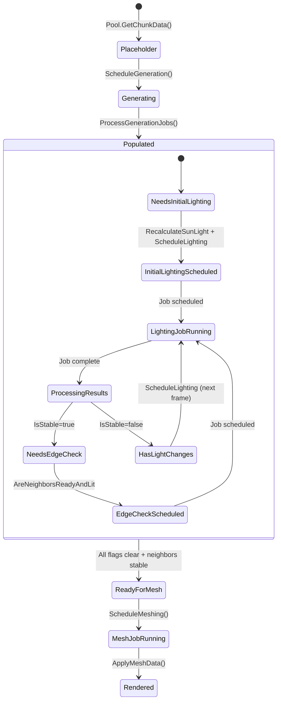
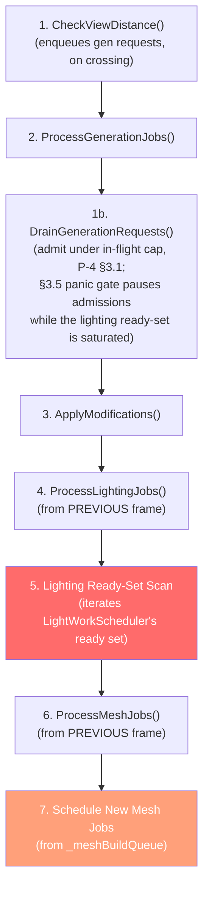
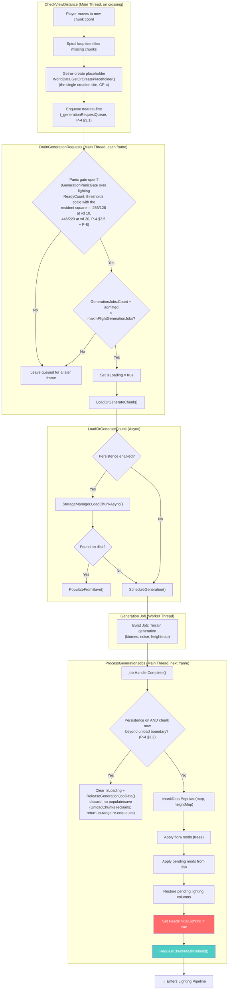
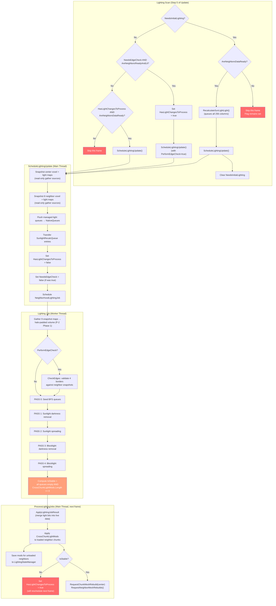
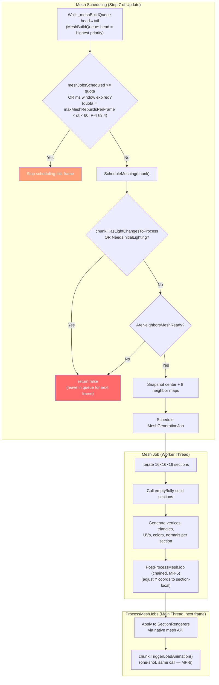
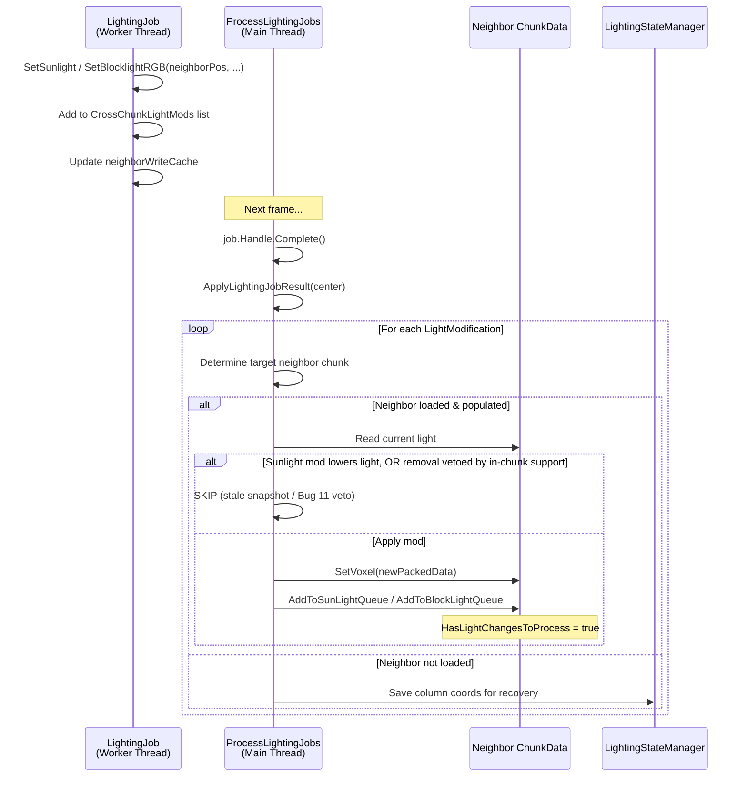
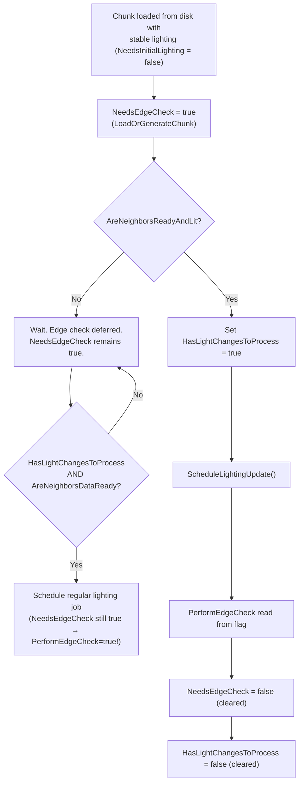
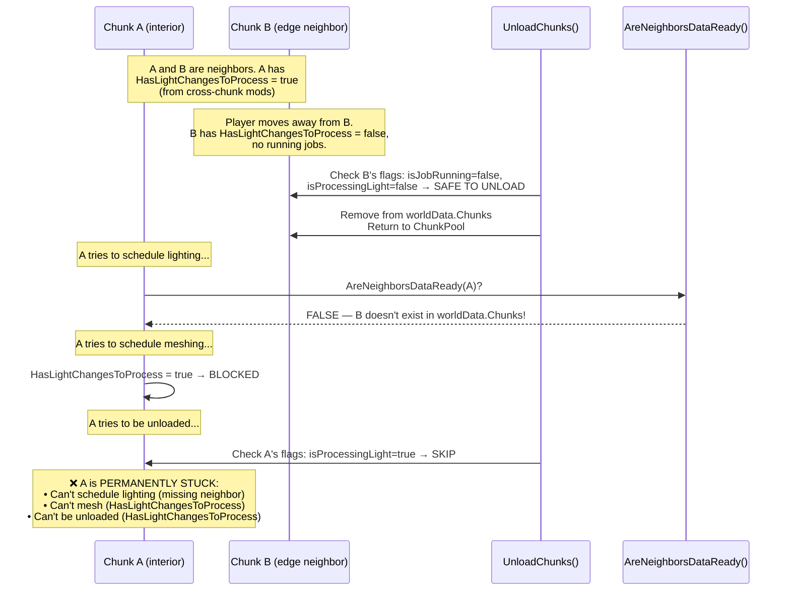

# Chunk Lifecycle Pipeline: Generation → Lighting → Meshing

**Status:** Living Document  
**Last Updated:** 2026-08-23 (§6 gains the `SunlightRecalculationQueue` work-store reference)  
**Purpose:** Comprehensive reference for how a chunk transitions from empty placeholder to rendered mesh, with all state flags, readiness gates, and inter-system dependencies fully mapped.

---

## 1. Executive Summary

The chunk lifecycle is a multi-stage, asynchronous pipeline orchestrated by **`World.Update()`** on the main thread. Each stage hands off work to the Unity Job System (Burst-compiled background threads) and processes results in subsequent frames. The pipeline has three primary stages:

1. **Generation** — Produces terrain voxel data (block IDs, heightmap).
2. **Lighting** — Calculates sunlight and blocklight via BFS flood-fill.
3. **Meshing** — Builds renderable mesh geometry from lit voxel data.

Each stage is gated by **readiness checks** on the chunk and its neighbors. A chunk cannot advance to the next stage until all prerequisites are met. The system is designed to converge — light values are bounded (0–15), BFS is deterministic — but edge cases in scheduling order, throttling, and cross-chunk dependencies can delay convergence under load.

---

## 2. State Flags Reference

Each `ChunkData` instance carries the following transient flags that control pipeline progression.

The three **lighting work** flags are not independent bools: they are bits of one `[Flags] LightingWork`
byte (`Data/LightingWork.cs`), exposed as get-only `bool` adapters and mutated **only** through named
transition methods on `ChunkData`. There is no setter — a raw write is a compile error. The set columns
below name the transition method each site calls; `Work` exposes the whole set and `HasAnyLightingWork`
answers "is this chunk quiet".

| Transition method | Effect on the work set |
|---|---|
| `FlagInitialLighting()` | `+InitialLighting` |
| `FlagLightWork()` | `+LightChanges` |
| `FlagEdgeCheck()` | `+EdgeCheck` |
| `FlagNeighborEdgeCheck()` | `+EdgeCheck +LightChanges` — armed together, never apart |
| `SpendEdgeCheckRound(rearm)` | `RemainingEdgeCheckRounds--`; when `rearm`, `+EdgeCheck +LightChanges` |
| `RegrantBorderEditEdgeRound()` | `RemainingEdgeCheckRounds = max(current, 1)` (Bug 05) |
| `ClearInitialLighting()` | `-InitialLighting` |
| `OnLightingJobScheduled()` | `-LightChanges -EdgeCheck` (the atomic schedule-clear) |
| `ClearEdgeCheck()` / `ClearLightWork()` | single-bit clears — **editor harness only**, see §4 |
| `ClearAllLightingWork()` | `= None` (lighting disabled, pool recycle) |

**What this buys:** the *combined* arming transitions — `FlagNeighborEdgeCheck` and the cascade re-arm —
set `EdgeCheck` and `LightChanges` in one indivisible call, so a post-merge chunk stays schedulable under
both the strict edge arm and the relaxed regular one. Splitting them would silently narrow it to the strict
arm and change reconciliation timing. A **lone** `EdgeCheck` is legal and used in production (the
disk-load-stable arm at `World.cs`): such a chunk waits on the strict edge gate, which pre-sets the
companion itself before scheduling — see the `0 0 1` row of the design doc's reachable-combination table.
Baselines B115–B119 guard the mapping.

| Flag                          | Type | Set By                                                                                                                                                                      | Cleared By                                                                                                                                                                                                                                                                          | Purpose                                                                                                                        |
|-------------------------------|------|-----------------------------------------------------------------------------------------------------------------------------------------------------------------------------|-------------------------------------------------------------------------------------------------------------------------------------------------------------------------------------------------------------------------------------------------------------------------------------|--------------------------------------------------------------------------------------------------------------------------------|
| `IsPopulated`                 | bool | `Populate()` / `PopulateFromSave()`                                                                                                                                         | `Reset()` (pool recycle)                                                                                                                                                                                                                                                            | Voxel data exists and is valid                                                                                                 |
| `IsLoading`                   | bool | `DrainGenerationRequests()` (at admission; `CheckViewDistance()` only *enqueues*, P-4 §3.1)                                                                                 | `ChunkData.Reset()` (pool recycle); **§3.2 out-of-range discard** in `ProcessGenerationJobs`; **CP-3 load-arm fault path** in `LoadOrGenerateChunk`'s catch (identity-guarded) so a faulted placeholder re-enqueues on the next boundary crossing instead of stranding forever (F1) | Prevents duplicate disk load requests                                                                                          |
| `NeedsInitialLighting`        | `LightingWork` bit (get-only) | `FlagInitialLighting()` from `ProcessGenerationJobs()` / `PopulateFromSave()` / the disk read; **`UnloadChunks()` persist-and-unload arm** (P-4 rec 3 — forces a full re-light on reload, captured by the save snapshot) | `ClearInitialLighting()` from the `Update()` lighting scan after scheduling the initial pass, the startup coroutine, and `LoadOrGenerateChunkInner`                                                                                                                                  | Chunk has terrain but no lighting yet                                                                                          |
| `HasLightChangesToProcess`    | `LightingWork` bit (get-only) | `FlagLightWork()` from `AddToSunLightQueue()` / `AddToBlockLightQueue()` / `QueueSunlightRecalculation()` / cross-chunk mods / a declined schedule / the edge-arm pre-set    | `OnLightingJobScheduled()` — one atomic call, together with `NeedsEdgeCheck`                                                                                                                                                                                                         | Pending light changes in managed queues                                                                                        |
| `NeedsEdgeCheck`              | `LightingWork` bit (get-only) | `FlagEdgeCheck()` (disk-load-stable), `FlagNeighborEdgeCheck()` (neighbor propagation), or `SpendEdgeCheckRound(rearm: true)` (post-stabilization re-arm)                    | `OnLightingJobScheduled()` — read **twice** first (the job's `PerformEdgeCheck` and LI-2's band derivation), then cleared with `HasLightChangesToProcess`                                                                                                                             | Border voxels need validation against neighbors                                                                                |
| `RemainingEdgeCheckRounds`    | int  | Initialized to 2 on `ChunkData`; reset to 2 by `Reset()`; re-granted to 1 by `ModifyVoxel` via `RegrantBorderEditEdgeRound()` on a border-column opacity edit (Bug 05)      | Decremented by `SpendEdgeCheckRound()`, applied from `EdgeCheckCascadeDecision.Apply()` — spent on a stable pass, and once P9-2's `enableConvergentEdgeCheckCascade` is on, spent **without** re-arming when the pass changed nothing                                                | Iterative edge-check rounds still to re-arm after a stable lighting pass (cross-seam convergence). `[NonSerialized]`.          |
| `LifecycleEpoch`              | int  | **Bumped** (never zeroed) by every `Reset()` — its reset IS the increment; monotonic across recycles                                                                        | Never — deliberately monotonic (B34 exempts it from the fresh-instance sweep and asserts the bump instead)                                                                                                                                                                          | Pool-ABA detection: async code captures instance + epoch and re-checks both after an await (CP-3 load arm). `[NonSerialized]`. |

### Flag Lifecycle Diagram


```mermaid
stateDiagram-v2
    [*] --> Placeholder: Pool.GetChunkData()
    Placeholder --> Generating: ScheduleGeneration()
    Generating --> Populated: ProcessGenerationJobs()

    state Populated {
        [*] --> NeedsInitialLighting
        NeedsInitialLighting --> InitialLightingScheduled: RecalculateSunLight + ScheduleLighting
        InitialLightingScheduled --> LightingJobRunning: Job scheduled
        LightingJobRunning --> ProcessingResults: Job complete
        ProcessingResults --> NeedsEdgeCheck: IsStable=true
        ProcessingResults --> HasLightChanges: IsStable=false
        HasLightChanges --> LightingJobRunning: ScheduleLighting (next frame)
        NeedsEdgeCheck --> EdgeCheckScheduled: AreNeighborsReadyAndLit
        EdgeCheckScheduled --> LightingJobRunning: Job scheduled
    }

    Populated --> ReadyForMesh: All flags clear + neighbors stable
    ReadyForMesh --> MeshJobRunning: ScheduleMeshing()
    MeshJobRunning --> Rendered: ApplyMeshData()
```

---

## 3. Readiness Gates

Three gate functions control when work can proceed. Understanding the differences between them is essential for diagnosing pipeline stalls.

> [!NOTE]
> ### One shared predicate behind all three (LP-2)
> `World`'s three gates no longer hand-roll their own neighbor loops. Each walks `VoxelData.AllNeighborOffsets`,
> assembles a `NeighborReadinessDecision.NeighborFacts` per neighbor, and calls the shared pure predicate
> `Helpers/NeighborReadinessDecision.Evaluate(gate, facts)` — the gate-side member of the same shared-guard
> family as `LightingScheduleDecision`, `LightingScanDecision` and `JobCompletionPass`. The editor lighting
> harness drives the identical predicate, so its gate analog can no longer silently disagree with production
> about the **rules**. It still synthesises one input (`existsAndPopulated: true`), so the shared guarantee
> does not extend to every fact — see the fidelity doc's B2.
>
> The caller still owns everything world-shaped: the `IsChunkInWorld` skip, the job-dictionary and chunk-map
> probes, and short-circuiting on the first blocking neighbor. `Evaluate` returns a `BlockReason` rather than
> a bool, so a caller can act on *which* term blocked rather than re-testing terms the predicate already
> evaluated.
>
> The tables below are the contract; the Chunk Pipeline suite's **B7** asserts every gate × fact combination
> against an independently written copy of them.

### 3.1 `AreNeighborsDataReady(ChunkCoord)`

**Used by:** Initial lighting scheduling, regular lighting scheduling (fallback path).

Checks all **8 horizontal neighbors** (cardinal + diagonal):

| Check          | Condition                              | Rationale                                                                                                                                                                                                                    |
|----------------|----------------------------------------|------------------------------------------------------------------------------------------------------------------------------------------------------------------------------------------------------------------------------|
| World bounds   | `IsChunkInWorld()` → skip if false     | WS-3: `IsChunkInWorld` is now always true (XZ fully unbounded, both signs), so this skip branch never fires — every neighbor is an ordinary frontier chunk that parks until populated. "Out-of-world" no longer exists in XZ |
| Generation job | `GenerationJobs.ContainsKey()` → false | Neighbor terrain must be complete                                                                                                                                                                                            |
| Data exists    | `Chunks.TryGetValue()` → exists        | Neighbor must have a ChunkData                                                                                                                                                                                               |
| Populated      | `IsPopulated` → true                   | Voxel data must be filled                                                                                                                                                                                                    |

**Summary:** "Do all neighbors have terrain data I can read?"

### 3.2 `AreNeighborsReadyAndLit(ChunkCoord)`

**Used by:** Edge check scheduling. (Mesh scheduling formerly used this gate; it now uses the relaxed `AreNeighborsMeshReady` — see §3.3 and §9.3.)

Checks all **8 horizontal neighbors** (cardinal + diagonal) with stricter requirements:

| Check                  | Condition                             | Rationale                                                                                            |
|------------------------|---------------------------------------|------------------------------------------------------------------------------------------------------|
| World bounds           | `IsChunkInWorld()` → skip if false     | As §3.1 — never fires post-WS-3                                                                       |
| Generation job         | `GenerationJobs.ContainsKey()` → false | Neighbor terrain must be complete                                                                     |
| Lighting job           | `LightingJobs.ContainsKey()` → false   | Neighbor must not be computing light                                                                  |
| Data exists + populated | `TryGetChunk()` + `IsPopulated`       | **Skips, does not block** — an unpopulated neighbor holds no light to settle. The two rows below are evaluated only when it is populated |
| Pending light changes  | `HasLightChangesToProcess` → false     | Neighbor must not have unscheduled work                                                               |
| Initial lighting       | `NeedsInitialLighting` → false         | Neighbor must have completed first lighting                                                           |

**Summary:** "Are all neighbors fully generated AND lighting-stable?"

> [!WARNING]
> **This gate is NOT a superset of `AreNeighborsDataReady`.** The table above used to open with "all of
> `AreNeighborsDataReady`", which is wrong in one case that matters: an absent or unpopulated neighbor
> **blocks** `AreNeighborsDataReady` but is **skipped** by this gate. So a chunk can pass `ReadyAndLit` while
> failing `DataReady`. B7 pins this asymmetry down explicitly.

### 3.3 `AreNeighborsMeshReady(ChunkCoord)` *(NEW)*

**Used by:** Mesh scheduling (via `ScheduleMeshing`).

Checks all **8 horizontal neighbors** (cardinal + diagonal) with relaxed requirements:

| Check                   | Condition                              | Rationale                                                                                                                                   |
|-------------------------|----------------------------------------|---------------------------------------------------------------------------------------------------------------------------------------------|
| World bounds            | `IsChunkInWorld()` → skip if false     | WS-3: `IsChunkInWorld` is now always true (XZ fully unbounded) — this skip branch never fires; every neighbor is an ordinary frontier chunk |
| Generation job          | `GenerationJobs.ContainsKey()` → false | Neighbor terrain must be complete                                                                                                           |
| Data exists + populated | `Chunks.TryGetValue()` + `IsPopulated` | Neighbor must have voxel data                                                                                                               |
| Initial lighting done   | `NeedsInitialLighting` → false         | Neighbor must have had at least one lighting pass                                                                                           |

**Does NOT check:** `lightingJobs`, `HasLightChangesToProcess`.

**Summary:** "Do all neighbors have populated data with at least one lighting pass complete?"

> [!NOTE]
> This gate was introduced to break the wave-front ping-pong deadlock. Chunks at the loading edge continuously reschedule lighting jobs, which caused `AreNeighborsReadyAndLit` to perpetually return false for their neighbors.
> The relaxed gate allows meshing with "good enough" data; any stale border lighting is corrected by the automatic re-mesh triggered when the neighbor's lighting job completes.

> [!NOTE]
> ### `NeedsEdgeCheck` is not a readiness-gate input
> Neither `AreNeighborsReadyAndLit` nor `AreNeighborsMeshReady` checks `NeedsEdgeCheck` on neighbors, and `ScheduleMeshing` does not check it on the center chunk. This means:
> - A neighbor with `NeedsEdgeCheck = true` does NOT block meshing or edge-check scheduling of the center chunk.
> - A chunk can be meshed before its own edge check runs — `NeedsEdgeCheck` is effectively "invisible" to the readiness gates.
>
> This is intentional: edge checks are quality corrections, not correctness blockers. Any border light they add triggers an automatic re-mesh. See `LIGHTING_SYSTEM_OVERVIEW.md` §3.5.

### 3.4 The behavior tick has no neighbor gate — reads resolve per voxel

Unlike lighting and meshing, `World.TickChunksParallel` schedules a chunk's fluid/grass tick on the sole condition that its active bucket is non-empty; there is no `AreNeighbors*` precondition. Correctness therefore rests entirely on each individual cross-seam **read** resolving to *void* when the neighbor has no data, which in turn rests on one invariant:

> **A chunk that is present in `Chunks` but not `IsPopulated` holds no voxel data. Every read of it must
> resolve to "no data", never to `Air`.**

This is not automatic: `ChunkData.GetVoxel` returns `0` (= `Air`) for a null section and
`ChunkData.FillJobVoxelMap` zero-fills them, so a placeholder looks like a clean column of air to any reader that only null-checks. Both fluid read paths enforce the invariant explicitly:

| Path       | Enforcement                                                                                                                                                                                                              |
|------------|--------------------------------------------------------------------------------------------------------------------------------------------------------------------------------------------------------------------------|
| Burst halo | `FluidBurstTicker.PrepareNeighbors` requires `IsPopulated`; otherwise the slot points at the empty buffer, which `GatherPaddedFluidVoxelsBand` sentinel-fills (`uint.MaxValue`) → `GetStateLocal` reports `Has == false` |
| Managed    | `WorldData.TryGetVoxel` resolves populated chunks only (checked live, after the last-chunk cache), so `GetVoxelState` → `ChunkData.GetState` returns null                                                                |

Dropping either check reintroduces Fluid Bug 18 (archived in `_FIXED_BUGS.md` → Fluid §18 — not to be confused with Lighting §18): border fluids read the placeholder ring as free space, spread into it, and
`ApplyModifications` persists the resulting cross-chunk mods via `ModManager.AddPendingMod` — which replays them over the neighbor's real terrain once it generates. Guarded by baselines **BH-B8** (Burst path) and **BH-B9**
(managed path) in `Validate Behavior`, promoted from the repro scenarios after the July 2026 in-game confirmation; each names its own prove-red mutation.

#### The seam wake — population's behavior-tick counterpart

The invariant above has a corollary: because a void read satisfies no spread test, a voxel whose only flow-receptive direction was a not-yet-loaded neighbor evaluates **inactive** and leaves its bucket on the first tick. Population alone does not bring it back — `RegisterActiveVoxelsFromJob` / `OnDataPopulated` register only the **newly populated chunk's own** voxels, and the sole cross-chunk wake (`ApplyModifications` step 4) needs an applied mod 6-adjacent to the sleeping cell.

`World.WakeSeamBehaviorNeighborhood` closes that loop. It is the behavior-tick sibling of
`PromoteLightWorkNeighborhood` and fires from the same two population sites — `ProcessGenerationJobs`'
completed-job sweep and the load-from-save path in `LoadOrGenerateChunkInner`:

| Property  | Value                                                                                                                                                                                                                                                                                                                                                                                                                                                                                                                                                                                                                                                                                                                    |
|-----------|--------------------------------------------------------------------------------------------------------------------------------------------------------------------------------------------------------------------------------------------------------------------------------------------------------------------------------------------------------------------------------------------------------------------------------------------------------------------------------------------------------------------------------------------------------------------------------------------------------------------------------------------------------------------------------------------------------------------------|
| Scope     | The 4 **cardinal** neighbors that are already `IsPopulated`. Whether a fluid is active depends only on its ±1 reads (`IsFluidActive`); the ≤4-cell pathfinder only ranks *directions*. A diagonal chunk is never an immediate neighbor, so it cannot change any activity decision.                                                                                                                                                                                                                                                                                                                                                                                                                                       |
| Depth     | The 1-deep slab facing the seam (16 × 128), walked section-by-section so an all-air span costs one null check.                                                                                                                                                                                                                                                                                                                                                                                                                                                                                                                                                                                                           |
| Gating    | The two facing slabs are walked as **pairs**: a neighbor voxel is woken only when the cell across the seam could change its evaluation. A solid cell is a wall to every fluid predicate — exactly what void already was — so it is skipped. Two rows are sampled, at **y and y+1**, and either admits when it is non-solid or is `BlockIDs.Dirt`. Solidity comes from the flat `World.IsSolidById`, co-built with `IsActiveById` in `JobDataManagerFactory` — a per-cell `BlockType` deref (it is a class) would cost more than the skip saves. **This skips most of a land or underground seam and nothing of an ocean seam** (water is non-solid); narrowing further would mean re-deciding activity outside the tick. |
| Direction | Only the already-populated side needs waking — the new chunk's own scan registers everything it has.                                                                                                                                                                                                                                                                                                                                                                                                                                                                                                                                                                                                                     |
| Families  | Agnostic: it routes through `ChunkData.AddActiveVoxel`, so grass (same `GetState` path, same gap) is covered — but only because the gate samples y+1. Grass's up-diagonal target (`s_grassSpreadVectors`' "Above Adjacent" entries) is `Dirt`, which is **solid**, so a same-Y-only gate would skip it; its y−1 path (`IsDirtNextToAir`) needs air at the same Y, which already admits. Guarded by **BH-B11**.                                                                                                                                                                                                                                                                                                           |
| Safety    | A woken voxel that is still stable simply re-evaluates inactive next tick — the wake cannot accumulate. Runs on the main thread in a different `Update` phase than `TickChunksParallel`, which completes every fluid handle before returning, so it cannot race an in-flight job.                                                                                                                                                                                                                                                                                                                                                                                                                                        |

Guarded by baseline **BH-B10** (`Validate Behavior`), whose prove-red is an early return from the method.

---

## 4. The Main Loop (`World.Update()`)

Every frame, `Update()` executes the following steps in order. Understanding this sequence is critical because **order determines which chunks get served first**.


```mermaid
flowchart TD
    A["1. CheckViewDistance()<br/>(enqueues gen requests, on crossing)"] --> B["2. ProcessGenerationJobs()"]
    B --> B1b["1b. DrainGenerationRequests()<br/>(admit under in-flight cap, P-4 §3.1;<br/>§3.5 panic gate pauses admissions<br/>while the lighting ready-set is saturated)"]
    B1b --> C["3. ApplyModifications()"]
    C --> D["4. ProcessLightingJobs()<br/>(from PREVIOUS frame)"]
    D --> E["5. Lighting Ready-Set Scan<br/>(iterates LightWorkScheduler's ready set)"]
    E --> F["6. ProcessMeshJobs()<br/>(from PREVIOUS frame)"]
    F --> G["7. Schedule New Mesh Jobs<br/>(from _meshBuildQueue)"]
    style E fill: #ff6b6b, color: #fff
    style G fill: #ffa07a, color: #fff
```

> **There is no step 8 (MP-6, 2026-07-25).** The stage that used to be step 8 drained a `ChunksToDraw` queue whose only
> remaining job — post-MR-5, when `ApplyMeshData` began uploading everything itself — was triggering the
> one-shot chunk load animation. It now fires inside step 6, the instant a chunk's mesh is applied. Two
> consequences worth knowing: the animations of a streaming wave start together rather than trickling
> (the deliberate visual change), and **no queue of `Chunk` references survives a frame**, so the pool can
> no longer recycle a slot out from under a pending draw (the old guard tested *destroyed*, not *recycled*).

### Per-job fault isolation in the three job passes (HF-2)

All three completed-job sweeps (`ProcessGenerationJobs`, `ProcessLightingJobs`, `ProcessMeshJobs`)
release each job's containers *inside* the loop and remove the dictionary entries only *after* it.
`ProcessGenerationJobs` and `ProcessMeshJobs` additionally take an optional
`PipelinePassBudget.Window` ms ceiling (P-4 §3.4, checked between jobs): on expiry the sweep breaks and the remaining completed jobs stay enrolled for next frame — the same retry contract as the generation pass's structure-mods budget. `default` = unbudgeted (the startup coroutine's path);
`ProcessLightingJobs` is deliberately not budgeted (its merge cost is §2/P-3 territory). Before HF-2, one exception mid-pass aborted the sweep and stranded already-released jobs in the dictionary — every later frame re-touched their disposed containers, spamming
`ObjectDisposedException` and burying the original thrower. Each pass now isolates faults per job:

- **`Handle.Complete()` throws** → the job may still own its buffers, so nothing is released; the entry stays enrolled and is retried (isolated again) next pass.
- **Post-`Complete()` processing throws** → one `Debug.LogError` (errors are the regression signal), the job's containers are still released and the entry enrolled for removal, and the pass continues. Per pass: lighting re-flags the chunk (`HasLightChangesToProcess = true`, stability unknown → a corrective pass runs) and counts the fault in `WorldJobManager.LastFaultedLightJobs`; generation releases only if the happy path had not (its budget-retry `continue` paths intentionally keep jobs un-released across frames); meshing returns the buffers in a
  `finally` and the chunk keeps its previous mesh.
- **Container release holds on fault:** the lighting pass releases the job's buffers in a per-job `finally`, so a faulted merge cannot leave a job enrolled with disposed containers.

Recovery is deliberately *not* promised (a faulted generation job can leave its chunk unpopulated, loudly) — the isolation exists to keep one fault from cascading into the whole pass, not to hide it.

That loop structure — iterate → complete → merge → release-inside-loop → enroll → remove-after-loop → promote-after, with the two-stage fault isolation above — is extracted into the shared `Helpers/JobCompletionPass.cs` (`RunMergeLoop` + `RunRemoveAndPromote`, driven through
`IJobCompletionDriver<TKey>`). **Both** the lighting and the meshing pass drive it (MP-4; the skeleton was lighting-only as `LightingCompletionPass` until then, hence the neutral name):

- `ProcessLightingJobs` implements the driver on `this`; the editor frame simulator implements it too, so the harness replays the exact same pass bookkeeping and can inject a merge fault to prove the isolation mechanically (baseline B65).
- `ProcessMeshJobs` drives it through a **separate cached driver object** (`WorldJobManager.MeshCompletionDriver`) — one class cannot implement `IJobCompletionDriver<ChunkCoord>` twice, and the lighting pass already holds that slot on `this`. Its hooks are the former inline body:
  merge = resolve the chunk + `ApplyMeshData`, release = the MR-6 output return + pooled-input release, remove = `MeshJobs.Remove` **only** (meshing has no promotion concept — the mesh build queue retries on its own).

The skeleton carries the P-4 §3.4 budget knobs as optional parameters (`window` ms ceiling checked *between* jobs, `startIndex` rotating visit start), so the unbudgeted lighting/sim callers stay byte-identical while the budgeted mesh pass keeps its rotating-start fairness. A window break simply leaves the un-visited remainder unenrolled — it stays in the registry and is retried next frame, holding its pooled buffers one more frame (bounded by the in-flight cap). The *cursor* stays owned by the caller, because advancing it is per-pass policy (production
gates the advance on `window.HasBudget` so the flag-off legs keep legacy order).

This is the completion-pass twin of the scheduling-side `LightingScanDecision` (§ shared arm decision) — HF-4. The skeleton's ordering contract is pinned world-free by the meshing suite's **B27** (recording fake driver: stage-1 carries over without releasing, stage-2 still releases + enrolls, remove strictly after the merge loop, window break, rotating start).

### Step 5: Lighting Ready-Set Scan (The Critical Section)

This is where most pipeline stalls originate. The dirty set lives in `LightWorkScheduler` (`Assets/Scripts/Helpers/LightWorkScheduler.cs`, MT-2), split into two `HashSet<Vector2Int>`s of chunks whose lighting flags (`NeedsInitialLighting`, `HasLightChangesToProcess`,
`NeedsEdgeCheck`) have been set to `true`:

- **Ready** — visited by the per-frame scan.
- **Waiting** — parked chunks whose readiness gate failed (or whose lighting job is in-flight); invisible to the scan until a promotion event moves them back. This keeps the per-frame cost at O (schedulable) instead of O (dirty) — under a backlog, blocked chunks no longer pay 8-neighbor gate evaluations every frame.

**Registration:** The three lighting flags are bits of one `LightingWork` byte, written only through `ChunkData`'s transition methods (§2). Every write funnels through one private `SetWork`, which fires the static callback (`ChunkData.OnLightWorkFlagged` → `LightWorkScheduler.Flag`) when **any bit rises 0→1** — clears and no-op writes never notify. The callback enqueues the chunk's position into a `ConcurrentQueue<Vector2Int>`, which is thread-safe and supports flagging from background deserialization threads (`ChunkSerializer.ReadChunkInternal` via `Task.Run`). The main thread drains this queue into the ready set at the start of the scan (promoting parked entries).

> A transition that raises **two** bits at once (`FlagNeighborEdgeCheck`, a cascade re-arm) fires the callback **once**, not twice. Staging dedupes into a `HashSet` on drain, so this is observationally identical to the two separate writes it replaced; B117 pins it.
>
> **Ownership:** the work byte is main-thread-only, with one sanctioned exception — deserialization fills a pool instance that has not been published to `WorldData` yet, so no other thread can see it. Because the three kinds now share one field, two threads writing the same *published* chunk would lose an update where three independent bools could not. Nothing enforces this but the contract on `SetWork`.

**Demotion (parking):** A visited ready chunk is moved to waiting when it cannot make progress: it is unpopulated, its lighting job is still in-flight, or its flags remain set but no branch could schedule (a readiness gate failed).

**Promotion:** A parked chunk re-enters the ready set on exactly the events that can flip its gate (`PromoteNeighborhood` promotes the parked entries of a 3×3 neighborhood, move-only):

1. **Terrain generation completed** — the completed-job sweep in `ProcessGenerationJobs` (the `GenerationJobs.Remove` is what flips `AreNeighborsDataReady` for the 8 neighbors).
2. **Disk load hydrated** — after `PopulateFromSave` in `LoadOrGenerateChunk` (same gate, load path).
3. **Lighting job completed** — the completed-job sweep in `ProcessLightingJobs` (the last event in an `AreNeighborsReadyAndLit` unblock chain, and what un-parks a chunk re-flagged mid-flight).
4. **Own flag transition** — `Flag` → staging drain (covers e.g. cross-chunk mods landing on a parked chunk).

**Fail-safe:** Every ~1 second (`FULL_LIGHT_SCAN_SECONDS`), a full scan of `worldData.Chunks.Values` runs to catch any chunks that were missed by the callback (e.g., flags set before the callback was registered), and `PromoteAll` moves the entire waiting set back to ready. This prevents permanent stalls: a missed promotion event degrades to ≤1 s of latency, never a deadlock. With `enableDiagnosticLogs`, a recurring non-zero fail-safe promotion count is logged — it means an unblock event lacks a promotion hook.

**Self-cleaning:** When the scan encounters a position whose chunk was unloaded (`TryGetValue` returns false), the stale entry is removed from both sets automatically. When a chunk's flags are all clear after processing, it is also removed.

**Shared arm decision:** The per-chunk arm selection below (initial vs. edge vs. regular vs. remove vs. park) is the pure function `LightingScanDecision.EvaluateReadyChunk` (`Assets/Scripts/Helpers/LightingScanDecision.cs`). Both `World.Update`'s scan and the editor
`LightingFrameSimulator`'s scheduler mode call it, so the live pipeline and its validation harness can never disagree on which arm a ready chunk takes (the shared-guard pattern of `LightingScheduleDecision`; roadmap AS-2 / HF-4). The pseudocode below is that function's logic inlined for readability.

```
// Drain thread-safe staging queue into main-thread ready set (promotes parked entries):
_lightWork.DrainStaging()

// Fail-safe full scan (every ~1 second):
foreach chunkData in worldData.Chunks.Values:
    if populated AND any lighting flag set:
        _lightWork.AddReady(position)
_lightWork.PromoteAll()                                       ← waiting → ready backstop

// Ready-set iteration (waiting set is NOT visited):
snapshot = ListPool.Get(_lightWork ready set)
quota  = PipelinePassBudget.ComputeQuota(maxLightJobsPerFrame, unscaledDeltaTime)  ← cap × dt × 60 (P-4 §3.4;
window = StartWindow(lightScheduleBudgetMs)                                          flag off → quota == cap, no window;
                                                                                     window starts AFTER the fail-safe scan)
foreach pos in snapshot:
    if lightJobsScheduled >= quota OR window.Expired
       OR lightingJobs.Count >= maxInFlightLightingJobs: BREAK ← throttle (rest stays ready);
                                                                 in-flight cap = pooled-buffer memory
                                                                 bound, budgets-on only (flag off =
                                                                 byte-exact legacy leg)
    if !worldData.Chunks.TryGetValue(pos): REMOVE, SKIP        ← self-clean (both sets)
    if !chunkData.IsPopulated: PARK, SKIP                      ← promoted on population
    if lightingJobs.ContainsKey(coord): PARK, SKIP             ← promoted on job completion

    if chunkData.NeedsInitialLighting:
        if AreNeighborsDataReady(coord):
            RecalculateSunLightLight()
            ScheduleLightingUpdate()        ← clears NeedsInitialLighting
            lightJobsScheduled++
    else:
        scheduled = false

        // Edge check path (strict gate)
        if chunkData.NeedsEdgeCheck AND AreNeighborsReadyAndLit(coord):
            chunkData.FlagLightWork()                  ← pre-set so the schedule guard passes
            scheduled = ScheduleLightingUpdate()       ← OnLightingJobScheduled(): clears BOTH bits

        // Regular lighting path (relaxed gate)
        if !scheduled AND chunkData.HasLightChangesToProcess AND AreNeighborsDataReady(coord):
            scheduled = ScheduleLightingUpdate()       ← OnLightingJobScheduled(): clears BOTH bits

        if scheduled: lightJobsScheduled++

    // Remove if all work is clear; otherwise PARK if nothing was scheduled (gate failed)
    if !chunkData.HasAnyLightingWork:
        _lightWork.Remove(pos)
    else if nothing scheduled this visit:
        _lightWork.MarkWaiting(pos)                            ← promoted by events above
```

> [!IMPORTANT]
> ### Critical Scheduling Detail
> `ScheduleLightingUpdate` takes no edge-check parameter — it reads `NeedsEdgeCheck` off the chunk itself. So **border edge work rides any successful schedule**, whichever arm produced it: a chunk that took the *regular* arm under the weaker `AreNeighborsDataReady` gate still edge-checks, without ever satisfying `AreNeighborsReadyAndLit`. §7 covers what that costs.
>
> The same applies to the `ScheduleEdge` arm's own failure mode: if `FlagLightWork()` is set but the schedule returns `false` (job already in flight — the earlier `LightingJobs.ContainsKey` guard makes this unreachable from the scan), the flag stays set and falls through to the regular path on a later visit, where the fallback picks the edge check up again.
>
> The contract is stated in full on `WorldJobManager.ScheduleLightingUpdate`'s `<remarks>`, including its **second** reader: `LightingBandDecision.DeriveBandHeight` consumes the same flag to admit the neighbor→center cross-seam term, which can widen the LI-2 Y-band to full height. That reader sits on the pooled (`Persistent`) path only, so the startup coroutine's `TempJob` schedules never reach it.

---

## 5. Full Pipeline Flowchart

### 5.1 New Chunk (Generation Path)


```mermaid
flowchart TD
    subgraph "CheckViewDistance (Main Thread, on crossing)"
        A1["Player moves to new chunk coord"] --> A2["Spiral loop identifies missing chunks"]
        A2 --> A3["Get-or-create placeholder<br/>WorldData.GetOrCreatePlaceholder()<br/>(the single creation site, CP-4)"]
        A3 --> A3b["Enqueue nearest-first<br/>(_generationRequestQueue, P-4 §3.1)"]
    end

    subgraph "DrainGenerationRequests (Main Thread, each frame)"
        A3b --> A4g{"Panic gate open?<br/>(GenerationPanicGate over lighting<br/>ReadyCount; thresholds scale with the<br/>resident square — 256/128 at vd 10,<br/>446/223 at vd 20, P-4 §3.5 + P-8)"}
        A4g -- No --> AWAIT
        A4g -- Yes --> A4{"GenerationJobs.Count + admitted<br/>&lt; maxInFlightGenerationJobs?"}
        A4 -- No --> AWAIT["Leave queued for a later frame"]
        A4 -- Yes --> A4b["Set IsLoading = true"]
        A4b --> A5["LoadOrGenerateChunk()"]
    end

    subgraph "LoadOrGenerateChunk (Async)"
        A5 --> B1{"Persistence enabled?"}
        B1 -- Yes --> B2["StorageManager.LoadChunkAsync()"]
        B2 --> B3{"Found on disk?"}
        B3 -- Yes --> LOAD["PopulateFromSave()"]
        B3 -- No --> B4["ScheduleGeneration()"]
        B1 -- No --> B4
    end

    subgraph "Generation Job (Worker Thread)"
        B4 --> C1["Burst Job: Terrain generation<br/>(biomes, noise, heightmap)"]
    end

    subgraph "ProcessGenerationJobs (Main Thread, next frame)"
        C1 --> D1["job.Handle.Complete()"]
        D1 --> DDISC{"Persistence on AND chunk now<br/>beyond unload boundary? (P-4 §3.2)"}
        DDISC -- Yes --> DDISC2["Clear IsLoading + ReleaseGenerationJobData()<br/>discard, no populate/save<br/>(UnloadChunks reclaims; return-to-range re-enqueues)"]
        DDISC -- No --> D2["chunkData.Populate(map, heightMap)"]
        D2 --> D3["Apply flora mods (trees)"]
        D3 --> D4["Apply pending mods from disk"]
        D4 --> D5["Restore pending lighting columns"]
        D5 --> D6["Set NeedsInitialLighting = true"]
        D6 --> D7["RequestChunkMeshRebuild()"]
    end

    D7 --> E["→ Enters Lighting Pipeline"]
    style D6 fill: #ff6b6b, color: #fff
    style D7 fill: #4ecdc4, color: #fff
```

#### Load-arm failure contract (CP-3)

The async load arm is no longer a fire-and-forget without a failure contract (the F1 silent-stall class): `LoadOrGenerateChunk` wraps its body and, on any fault, logs **one** `Debug.LogError`, clears the placeholder's `IsLoading` (identity-guarded — only if the placeholder is still the same instance AND pool lifecycle it admitted, via `ChunkData.LifecycleEpoch`, so a late fault can never clear the flag on a successor load even when the pool re-issues the same object for the same coord), and returns. The mid-await unload guard inside the load body uses
the same instance + epoch check. The placeholder stays in `worldData.Chunks`; the next `CheckViewDistance` boundary crossing re-enqueues it and `DrainGenerationRequests` re-admits it — natural retry for transient I/O faults. A *persistently* faulting file surfaces as a repeating error log (loud), and a *corrupt* payload keeps its own deliberate arm: `ChunkSerializer.Deserialize` catches the parse failure, **returns the pooled shell and its attached sections to the concurrent pools** (no leak), and yields null →
"not on disk" → regenerate. The storage boundary keeps the two outcomes distinct: a thrown I/O fault must **never** surface as the null "not on disk" result, or the load arm would regenerate terrain over the player's saved data — `RegionFile.LoadChunkData` returns null only for its explicit corrupt-shape branches and rethrows unexpected faults, and `ChunkStorageManager.GetRegion`
evicts a faulted `Lazy<RegionFile>` so one transient open fault cannot poison the region for the session. Teardown cancellation (`OperationCanceledException`) stays a rethrow — not a fault. Guarded by `Minecraft Clone/Dev/Validate Deserialization Robustness` (NS-1 seed, B1–B7; dev-only
`ChunkStorageManager.InjectLoadFaults` seam); see the CP doc §3.3/§7 CP-3.

### 5.2 Lighting Pipeline


```mermaid
flowchart TD
    subgraph "Lighting Scan (Step 5 of Update)"
        L1{"NeedsInitialLighting?"}
        L1 -- Yes --> L2{"AreNeighborsDataReady?"}
        L2 -- No --> L_WAIT1["Skip this frame<br/>Flag remains set"]
        L2 -- Yes --> L3["RecalculateSunLightLight()<br/>(queues all 256 columns)"]
        L3 --> L4["ScheduleLightingUpdate()"]
        L4 --> L5["Clear NeedsInitialLighting"]
        L1 -- No --> L6{"NeedsEdgeCheck AND<br/>AreNeighborsReadyAndLit?"}
        L6 -- Yes --> L7["Set HasLightChangesToProcess = true"]
        L7 --> L8["ScheduleLightingUpdate()<br/>(with PerformEdgeCheck=true)"]
        L6 -- No --> L9{"HasLightChangesToProcess AND<br/>AreNeighborsDataReady?"}
        L9 -- Yes --> L10["ScheduleLightingUpdate()"]
        L9 -- No --> L_WAIT2["Skip this frame"]
    end

    subgraph "ScheduleLightingUpdate (Main Thread)"
        L4 --> S1["Snapshot center voxel + light maps<br/>(read-only gather sources)"]
        L8 --> S1
        L10 --> S1
        S1 --> S2["Snapshot 8 neighbor voxel + light maps<br/>(read-only gather sources)"]
        S2 --> S3["Flush managed light queues → NativeQueues"]
        S3 --> S4["Transfer SunlightRecalcQueue entries"]
        S4 --> S5["Set HasLightChangesToProcess = false"]
        S5 --> S6["Set NeedsEdgeCheck = false (if was true)"]
        S6 --> S7["Schedule NeighborhoodLightingJob"]
    end

    subgraph "Lighting Job (Worker Thread)"
        S7 --> J0["Gather 9 snapshot maps →<br/>halo-padded volume (P-2 Phase 1)"]
        J0 --> J1{"PerformEdgeCheck?"}
        J1 -- Yes --> J2["CheckEdges: validate 4 borders<br/>against neighbor snapshots"]
        J2 --> J3
        J1 -- No --> J3["PASS 0: Seed BFS queues"]
        J3 --> J4["PASS 1: Sunlight darkness removal"]
        J4 --> J5["PASS 2: Sunlight spreading"]
        J5 --> J6["PASS 3: Blocklight darkness removal"]
        J6 --> J7["PASS 4: Blocklight spreading"]
        J7 --> J8["Compute IsStable =<br/>all queues empty AND<br/>CrossChunkLightMods.Length == 0"]
    end

    subgraph "ProcessLightingJobs (Main Thread, next frame)"
        J8 --> P1["ApplyLightingJobResult<br/>(merge light bits into live data)"]
        P1 --> P2["Apply CrossChunkLightMods<br/>to loaded neighbor chunks"]
        P2 --> P3{"IsStable?"}
        P3 -- Yes --> P4["RequestChunkMeshRebuild(center)<br/>RequestNeighborMeshRebuilds()"]
        P3 -- No --> P5["Set HasLightChangesToProcess = true<br/>(will reschedule next frame)"]
        P2 --> P6["Save mods for unloaded neighbors<br/>to LightingStateManager"]
    end

    style L_WAIT1 fill: #ff6b6b, color: #fff
    style L_WAIT2 fill: #ff6b6b, color: #fff
    style J8 fill: #ffa07a, color: #fff
    style P5 fill: #ff6b6b, color: #fff
```

### 5.3 Meshing Pipeline


```mermaid
flowchart TD
    subgraph "Mesh Scheduling (Step 7 of Update)"
        M1["Walk _meshBuildQueue head→tail<br/>(MeshBuildQueue: head = highest priority)"]
        M1 --> M2{"meshJobsScheduled >= quota<br/>OR ms window expired?<br/>(quota = maxMeshRebuildsPerFrame × dt × 60, P-4 §3.4)"}
        M2 -- Yes --> M_DONE["Stop scheduling this frame"]
        M2 -- No --> M3["ScheduleMeshing(chunk)"]
        M3 --> M4{"chunk.HasLightChangesToProcess<br/>OR NeedsInitialLighting?"}
        M4 -- Yes --> M_SKIP["return false<br/>(leave in queue for next frame)"]
        M4 -- No --> M5{"AreNeighborsMeshReady?"}
        M5 -- No --> M_SKIP
        M5 -- Yes --> M6["Snapshot center + 8 neighbor maps"]
        M6 --> M7["Schedule MeshGenerationJob"]
    end

    subgraph "Mesh Job (Worker Thread)"
        M7 --> MJ1["Iterate 16×16×16 sections"]
        MJ1 --> MJ2["Cull empty/fully-solid sections"]
        MJ2 --> MJ3["Generate vertices, triangles,<br/>UVs, colors, normals per section"]
        MJ3 --> MP1["PostProcessMeshJob (chained, MR-5)<br/>(adjust Y coords to section-local)"]
    end

    subgraph "ProcessMeshJobs (Main Thread, next frame)"
        MP1 --> MP2["Apply to SectionRenderers<br/>via native mesh API"]
        MP2 --> MP3["chunk.TriggerLoadAnimation()<br/>(one-shot, same call — MP-6)"]
    end

    style M_SKIP fill: #ff6b6b, color: #fff
    style M_DONE fill: #ffa07a, color: #fff
```

> **Shared decision & drain policy (MP-2).** The three scheduling gates (M3–M5) are the pure function
> `MeshingScheduleDecision.Evaluate` (in-flight → center-light → neighbor precedence, with the
> lighting-disabled bypass), and the per-frame drain loop (M1–M7 walk plus the quota/window/in-flight-cap
> stops, null/inactive purge, and remove-on-schedule vs leave-on-decline) is `MeshDrainPolicy.Drain`.
> Both are shared verbatim by production (`ScheduleMeshing` / `World.Update`) and the `Validate Meshing`
> suite (baselines **B24** decision census, **B25** drain policy), so the gate composition and drain
> policy can never silently diverge from their tests — the meshing sibling of `LightingScheduleDecision`.
>
> **In-flight request policy (MP-3).** When the in-flight gate fires (a mesh job is already running for the
> chunk), `ScheduleMeshing` now returns `false` — the shared `MeshingScheduleDecision.DequeuesChunk` maps
> only `Schedule` to a dequeue, so the request is **left queued** and reschedules the frame after the flight
> completes. Previously it returned `true`, so the drain dequeued and dropped the rebuild against the job's
> stale schedule-time snapshot (the F1 lost update — a stale on-screen mesh until an unrelated trigger, and
> the case a lighting-disabled world could never self-correct). Baseline **B26** guards it: the pure mapping
> plus a two-frame drain scenario (survives while in flight, schedules after).

---

## 6. Cross-Chunk Modification Flow

When a lighting job produces changes that affect neighbor chunks, the modifications follow this specific path:


```mermaid
sequenceDiagram
    participant Job as LightingJob<br/>(Worker Thread)
    participant Main as ProcessLightingJobs<br/>(Main Thread)
    participant NChunk as Neighbor ChunkData
    participant LSM as LightingStateManager
    Job ->> Job: SetSunlight / SetBlocklightRGB(neighborPos, ...)
    Job ->> Job: Add to CrossChunkLightMods list
    Job ->> Job: Update neighborWriteCache
    Note over Main: Next frame...
    Main ->> Main: job.Handle.Complete()
    Main ->> Main: ApplyLightingJobResult(center)

    loop For each LightModification
        Main ->> Main: Determine target neighbor chunk
        alt Neighbor loaded & populated
            Main ->> NChunk: Read current light
            alt Sunlight mod lowers light, OR removal vetoed by in-chunk support
                Main ->> Main: SKIP (stale snapshot / Bug 11 veto)
            else Apply mod
                Main ->> NChunk: SetVoxel(newPackedData)
                Main ->> NChunk: AddToSunLightQueue / AddToBlockLightQueue
                Note over NChunk: HasLightChangesToProcess = true
            end
        else Neighbor not loaded
            Main ->> LSM: Save column coords for recovery
        end
    end
```

### Cross-Chunk Sunlight Guard Logic

`ProcessLightingJobs` routes every cross-chunk mod through `LightingJobProcessor.RouteCrossChunkMod` (drop / persist / defer / apply), then applies the per-voxel decision via `CrossChunkLightModApplier.ComputeSunlight` — shared with the editor lighting validation suite. Three rules guard sunlight, all evaluated against the neighbor's **current** value:

1. **Only-increase guard:** If `mod.LightLevel > 0 AND mod.LightLevel < currentSunlight` → skip (and an equal value is a no-op). Cross-chunk mods are computed against a stale schedule-time snapshot, so they may only **raise** sunlight; the neighbor's own column recalculation owns decreases.

2. **Bug 11 in-chunk-support veto:** A removal (`mod.LightLevel == 0`) is skipped when a voxel *inside the receiving chunk* still independently supports the current value (`CrossChunkLightModApplier.InChunkSunlightSupport ≥ currentSunlight`). Support is attenuated by the target voxel's own opacity via `LightAttenuation.Attenuate`, and fully-opaque neighbors (which cannot propagate sky light) are excluded. Without this, two adjacent chunks that removed each other's shared seam column against stale snapshots oscillate forever (the reloaded-world stall).
   See baselines B48/B49 and `LIGHTING_SYSTEM_OVERVIEW.md` §3.7.

3. **Genuine darkness (level=0, unsupported):** Applied. These are critical for block removal/placement to propagate shadow correctly across borders.

### `SunlightRecalculationQueue` — the fourth work store

Besides the three per-chunk flags (§2), pending lighting work also lives in
`WorldData.SunlightRecalculationQueue`: a `Dictionary<Vector2Int, HashSet<Vector2Int>>` keyed by **chunk voxel
origin**, whose values are **global** column positions awaiting a sunlight recalculation. Unlike the flags, it is
a side table, and **nothing structurally enforces that a queued column's owner is flagged** — the pairing is held
by convention at each writer.

**Producers (3):**

| Site | Behavior |
|---|---|
| `WorldData.QueueSunlightRecalculation` (`WorldData.cs:460`) | Writes the key **unconditionally**, then sets `HasLightChangesToProcess` **only if the owner chunk is resident**. |
| Disk-load restore (`World.cs:1358`) | Writes the dictionary directly (union into an existing set, or hand over a pooled one) and sets the flag by hand adjacent (`:1368`). |
| Generation-completion restore (`WorldJobManager.cs:1218`) | Same shape, additionally gated on `enableLighting`. |

**Consumers (2):** `ScheduleLightingUpdate` (`WorldJobManager.cs:831`) drains the columns into the lighting job,
removes the key and releases the pooled set — the normal exit. `UnloadChunks` (`World.cs:3688`) persists any
remainder via `PersistOrphanedSunlightColumns` (`:3692`), then removes the key and releases the set (`:3696`)
**strictly before** the only `worldData.RemoveChunk` (`:3754`), so unload never leaves a key behind.

**Why the pairing matters.** The ~1 s fail-safe scan re-flags work using `IsPopulated AND (any lighting flag)`.
An owner that fails that predicate is skipped, so its queued columns sleep until something else moves them —
in the worst case not until unload persists them. Two states fail it **legitimately** and are not defects:

- **No resident owner.** Because `QueueSunlightRecalculation` writes the key unconditionally, a BFS spilling
  across a border into unloaded territory mints an ownerless key by design; it is collected when that chunk
  loads, or on shutdown (`World.cs:5129`–`:5136`).
- **Resident but not yet populated.** A placeholder can carry the flag while still loading; `PopulateFromSave`
  only ORs flags in and never clears, so the flag survives population and the state self-heals.

> **Observability (LP-1, dev/editor only).** `World.ScanSunlightQueuePairing` walks this store once per fail-safe
> scan and classifies every key against exactly the predicate above, counting genuine violations separately from
> the two legitimate states, and surfacing all of it on the debug HUD's Chunk Lifecycle block. It is
> `[Conditional]`-compiled, carries its own `WorldFrameProfiler.Phase.LightQueueProbe` slot, and changes no
> behavior. A soak on 2026-08-23 observed zero violations; see `LIGHTING_PIPELINE_STATE_REFACTOR.md` §7 (LP-1)
> for that evidence and its limits. **LP-4 is the phase that replaces the convention with structure.**

---

## 7. `NeedsEdgeCheck` Lifecycle Deep-Dive

The edge check system was added to correct light inconsistencies at chunk borders caused by load-order dependencies. Here is the complete lifecycle:


```mermaid
flowchart TD
    E3["Chunk loaded from disk with<br/>stable lighting (NeedsInitialLighting = false)"] --> E4["NeedsEdgeCheck = true<br/>(LoadOrGenerateChunk)"]
    E4 --> E5{"AreNeighborsReadyAndLit?"}
    E5 -- No --> E6["Wait. Edge check deferred.<br/>NeedsEdgeCheck remains true."]
    E6 --> E7{"HasLightChangesToProcess<br/>AND AreNeighborsDataReady?"}
    E7 -- Yes --> E8["Schedule regular lighting job<br/>(NeedsEdgeCheck still true → PerformEdgeCheck=true!)"]
    E7 -- No --> E6
    E5 -- Yes --> E9["Set HasLightChangesToProcess = true"]
    E9 --> E10["ScheduleLightingUpdate()"]
    E10 --> E11["PerformEdgeCheck read from flag"]
    E11 --> E12["NeedsEdgeCheck = false (cleared)"]
    E12 --> E13["HasLightChangesToProcess = false (cleared)"]
```

> [!NOTE]
> ### When is NeedsEdgeCheck set?
> There are three set sites (plus one indirect trigger):
> 1. **Disk load** — `LoadOrGenerateChunk` sets `NeedsEdgeCheck = true` for chunks loaded with stable lighting (may have stale border lighting from a previous session).
> 2. **Post-stabilization re-arm (iterative rounds)** — `ProcessLightingJobs` re-arms `NeedsEdgeCheck` (+ `HasLightChangesToProcess`) on a chunk each time its lighting job reports `IsStable`, as long as `RemainingEdgeCheckRounds > 0` (default 2). This is what gives **freshly generated** chunks their edge checks — they get them after their initial lighting stabilizes, not when `NeedsInitialLighting` clears.
> 3. **Neighbor propagation** — when a chunk re-arms in (2) it also calls `TriggerNeighborEdgeChecks`, setting `NeedsEdgeCheck` on its 4 cardinal neighbors that are populated and past initial lighting.
>
> *Indirect (Bug 05 fix):* a **border-column opacity edit** does not set `NeedsEdgeCheck` directly — it re-grants `RemainingEdgeCheckRounds` (to 1) in `ModifyVoxel`, so the *next* stable pass re-arms via site (2). This gives a post-generation edit its reconciling border check even after generation spent the original 2 rounds.
>
> Round 1 fixes the immediate frontier against the latest neighbor data; round 2 reconciles the remainder after neighbors have run their own edge checks. The counter is `[NonSerialized]` and reset to 2 by `ChunkData.Reset()`.
>
> *P9-2 (August 2026, behind `Settings.enableConvergentEdgeCheckCascade`, default OFF):* sites (2) and (3) are gated on the merge having actually **changed light**, not merely on `IsStable` — which is also true of a pass that wrote nothing. The predicate is `EdgeCheckCascadeDecision.Evaluate(flag, remainingRounds, lightChanged, hasPendingLightWork)`, returning `None` / `SpendOnly` / `SpendAndRearm`; with the flag off it never yields `SpendOnly` and so reduces to the `RemainingEdgeCheckRounds > 0` test described above, leaving the shipped path unchanged.
**The round is spent either way** (`SpendOnly`) — only the flags buy lighting schedules, so declining the round would save nothing while letting a converged chunk hoard budget for its whole residency, which would break the premise the Bug-05 top-up rests on below and arm cascades on ordinary post-generation edits that this system never armed.

> [!IMPORTANT]
> ### Edge Check Fallback Path — an explicit contract, not an accident
> When `NeedsEdgeCheck = true` but `AreNeighborsReadyAndLit` returns `false`, the scan's dedicated edge arm does NOT fire.
> If the chunk ALSO has `HasLightChangesToProcess = true` (cross-chunk mods, an edit, a re-flagged unstable pass), the **regular arm** fires instead, under the weaker `AreNeighborsDataReady` gate — and because `ScheduleLightingUpdate` reads `chunkData.NeedsEdgeCheck` off the chunk rather than taking it as an argument, that job performs the edge check anyway. The flag is consumed either way.
>
> **This is the contract, stated on the method** (`ScheduleLightingUpdate`'s `<remarks>`): *border edge work rides any successful schedule*. Two readers consume the flag — `NeighborhoodLightingJob.PerformEdgeCheck` and `LightingBandDecision.DeriveBandHeight` (which admits the neighbor→center cross-seam term, potentially widening the Y-band to full height; pooled path only). A change to either alters what the job does, so both are named in the contract.
>
> The cost is real: edge checks can run against **neighbor lighting that has not settled**. The edge check only ADDS light (never removes), which bounds the damage, but corrections may be incomplete — the affected chunk gets another round while `RemainingEdgeCheckRounds > 0`.
---

## 8. `IsStable` — The Convergence Signal

A lighting job reports `IsStable = true` only when ALL of the following are true after the BFS completes (in `NeighborhoodLightingJob`):

1. Sunlight removal queue is empty
2. Sunlight placement queue is empty
3. Blocklight removal queue is empty
4. Blocklight placement queue is empty
5. **`CrossChunkLightMods.Length == 0`** ← This is the critical one

**Implication:** Initial lighting (which recalculates all 256 columns) almost always produces cross-chunk modifications at the borders, making `IsStable = false` on the first pass. This means:

- Every chunk requires **at least 2 lighting passes** after initial generation.
- The first pass produces cross-chunk mods.
- The second pass (if no new mods arrived from neighbors in the meantime) stabilizes.

When `IsStable = true`:

- A mesh rebuild is requested for the center chunk and its neighbors (`RequestChunkMeshRebuild` + `RequestNeighborMeshRebuilds`).
- If `RemainingEdgeCheckRounds > 0`, the counter is decremented and the chunk re-arms `NeedsEdgeCheck` + `HasLightChangesToProcess` on itself and `NeedsEdgeCheck` on its 4 cardinal neighbors (`TriggerNeighborEdgeChecks`). So a "stable" chunk normally still runs up to two more lighting passes for iterative border convergence (see §7).

When `IsStable = false`:

- `HasLightChangesToProcess = true` is set on the center chunk.
- No mesh rebuild is requested.
- The chunk re-enters the lighting scan next frame.

> [!NOTE]
> The stability test itself is computed only from the BFS queues + raw `CrossChunkLightMods.Length` inside the job. On the main thread, `LightingJobProcessor.IsEffectivelyStable` then overrides it to `true` when the only outstanding mods target out-of-world positions (which can never be consumed) — otherwise world-boundary chunks would reschedule lighting indefinitely. *(WS-3 note: with XZ fully unbounded, cross-chunk light mods — always horizontal, same Y — can no longer be out-of-world, so this override is effectively dead for XZ; undeliverable
frontier mods take the `PersistUndeliverable` route instead, which lets a frontier chunk settle exactly like any interior frontier.)*

---

## 9. Identified Risk Areas for Pipeline Stalls

### 9.1 Dictionary Iteration + Throttle Starvation

**Mechanism:** The lighting scan previously iterated `worldData.Chunks.Values` (a `Dictionary<Vector2Int, ChunkData>`). Dictionary iteration order is **non-deterministic** and may change when entries are added/removed. Combined with the `maxLightJobsPerFrame = 32` throttle and the `break`, certain chunks could be consistently visited late in the iteration and starved if the throttle was exhausted by chunks visited earlier.

**Risk Level:** Low. ~~Medium~~.

**Status:** ✅ **MITIGATED** — The lighting scan now iterates a dirty set containing only chunks with pending work, instead of all loaded chunks. This drastically reduces iteration count during steady state (0–5 entries vs 625+). The `HashSet` iteration order is still non-deterministic, but with far fewer entries, throttle starvation is effectively eliminated. MT-2 further split the dirty set into ready/waiting subsets (`LightWorkScheduler`), so under a backlog the scan visits only schedulable chunks — gate-blocked chunks are parked and re-enter via
event-driven promotion (see Step 5).

*P-4 §3.4 note:* the throttle itself is now a rate quota (`maxLightJobsPerFrame × unscaledDeltaTime × 60`) plus a Stopwatch ms ceiling instead of the fixed count — but the **break semantics this section depends on are unchanged**: a budget break leaves the un-served remainder in the READY set (never parked), exactly like the old count break, so no new promotion event is needed.

### 9.2 Cross-Chunk Mod Ping-Pong

**Mechanism:** When chunk A's lighting job produces cross-chunk mods for neighbor B, B gets `HasLightChangesToProcess = true`. B then runs its lighting job, potentially producing mods back for A. This sets A's `HasLightChangesToProcess = true` again, preventing A from being meshed (because `ScheduleMeshing` checks this flag on the center chunk).

**Convergence:** Light values are bounded 0-15 and the BFS is monotonic within a pass. The cross-chunk sunlight guard (only INCREASE allowed for non-zero mods) further constrains oscillation. This should converge in 2-3 rounds.

**Risk Level:** Low for isolated chunks. Medium when combined with continuous new chunk loading (see 9.3).

**Status:** ✅ **FIXED** — Removed `lightingJobs.ContainsKey(chunkCoord)` from the center chunk gate in `ScheduleMeshing`. The meshing job and lighting job now operate on independent snapshot copies of the voxel data, so they can safely run in parallel. Any stale lighting is automatically corrected by the subsequent `RequestChunkMeshRebuild` when the lighting job stabilizes.

### 9.3 Wave-Front Starvation (The Likely Deadlock Candidate)

**Mechanism:** When the player moves in one direction, a wave of new chunks enters the load distance:

1. New edge chunks generate terrain → `NeedsInitialLighting = true`
2. Initial lighting runs → produces cross-chunk mods for interior chunks
3. Interior chunks get `HasLightChangesToProcess = true`
4. Interior chunks can't mesh because `HasLightChangesToProcess` or `AreNeighborsReadyAndLit` fails
5. More new chunks arrive at the edge, producing MORE cross-chunk mods
6. Interior chunks' `HasLightChangesToProcess` keeps getting re-set before they can stabilize

This creates a **starvation cascade** where interior chunks are perpetually blocked by the wave of arriving edge chunks destabilizing their neighbors.

**Risk Level:** **HIGH** — matches the user-reported symptom of "large swathes of chunks not being meshed when loading from the same direction."

**Status:** ✅ **FIXED** — Replaced `AreNeighborsReadyAndLit` with `AreNeighborsMeshReady` in `ScheduleMeshing`. The relaxed gate allows meshing when neighbors have running lighting jobs, breaking the starvation cycle.
`DATA_LOAD_BUFFER` increased from 2 to 3 to ensure any transient stale-data artifacts are corrected in the invisible buffer zone before the chunk becomes visible.

### 9.4 Edge Check Gate Strictness

**Mechanism:** `NeedsEdgeCheck` requires `AreNeighborsReadyAndLit` to fire via the primary path. If neighbors are perpetually cycling through lighting passes (due to 9.3), the edge check never gets the strict gate satisfied. However, the fallback path (section 7) means the edge check eventually fires with the weaker gate.

**Risk Level:** Low for correctness (fallback exists). But the fallback might run edge checks against stale data, producing suboptimal corrections.

### 9.5 Mesh Queue Population Race

**Mechanism:** `RequestChunkMeshRebuild` is called from multiple places:

- `ProcessGenerationJobs` (when chunk has a visual and completes generation)
- `ProcessLightingJobs` (when `IsStable = true`)
- `LoadOrGenerateChunk` (when loading from disk with stable lighting)
- `CheckViewDistance` (when activating a chunk that already has data)

If the chunk is not added to `_meshBuildQueue` (e.g., because `chunk.isActive` was false at the time, or the chunk wasn't in the `_chunkMap` yet), and no subsequent code path re-adds it, the chunk is **permanently orphaned** from the mesh queue.

**Risk Level:** Medium. The guards in `RequestChunkMeshRebuild` (`chunk == null || !chunk.IsActive`, plus `MeshBuildQueue.TryEnqueue`'s by-coordinate duplicate rejection) can filter out valid requests if timing is unfortunate.

> **MP-1 (2026-07-24) — the drops are observable, not just conventional.** This risk was originally rated
> on the basis that *nothing observed a drop*, so correctness rested entirely on the convention that every
> drop site has a later re-request. `World.CountMeshRequest` now runs at the top of
> `RequestChunkMeshRebuild` and tallies `MeshRequestTotal` against the two drop buckets
> `MeshRequestNullDrops` / `MeshRequestInactiveDrops`, warning once with the offending coord and reporting
> the ratio in the `[MP-1]` diagnostics dump. It is `[Conditional("UNITY_EDITOR")]` +
> `[Conditional("DEVELOPMENT_BUILD")]`, so the machinery compiles out of release builds entirely.
>
> This **measures** the population race; it does not close it. A dropped request is still dropped — the
> probe only means a session that suffers one leaves evidence instead of a silently missing mesh. The
> risk level therefore stays Medium.

> **MP-3 (2026-07-24) — one drop vector closed.** A distinct drop existed at the *drain*, not the request:
> a rebuild requested while the chunk's mesh job was in flight was dequeued and dropped against the job's
> stale snapshot (F1). `ScheduleMeshing` now leaves an in-flight request queued (see §5.3), so it survives to
> a post-completion rebuild instead of being lost. This does not resolve the §9.5 *population* race above
> (a request that never reaches the queue) — only the in-flight-drop vector. See
> [MESHING_PIPELINE_ORCHESTRATION_REFACTOR.md](../Design/MESHING_PIPELINE_ORCHESTRATION_REFACTOR.md) MP-3.

### 9.6 Unload Stranding — Confirmed Deadlock Vector ⚠️

> [!CAUTION]
> This is the most dangerous identified risk and the **most likely root cause** of the observed deadlock. It creates a permanent stall that matches all reported symptoms.

**Mechanism:** When `UnloadChunks()` removes a chunk from memory, it only inspects the **chunk being unloaded** — it does NOT check whether removing it would strand a neighbor.

**Deadlock Sequence:**


```mermaid
sequenceDiagram
    participant A as Chunk A (interior)
    participant B as Chunk B (edge neighbor)
    participant Unload as UnloadChunks()
    participant Gate as AreNeighborsDataReady()
    Note over A, B: A and B are neighbors. A has<br/>HasLightChangesToProcess = true<br/>(from cross-chunk mods)
    Note over B: Player moves away from B.<br/>B has HasLightChangesToProcess = false,<br/>no running jobs.
    Unload ->> B: Check B's flags: isJobRunning=false,<br/>isProcessingLight=false → SAFE TO UNLOAD
    Unload ->> B: Remove from worldData.Chunks<br/>Return to ChunkPool
    Note over A: A tries to schedule lighting...
    A ->> Gate: AreNeighborsDataReady(A)?
    Gate -->> A: FALSE — B doesn't exist in worldData.Chunks!
    Note over A: A tries to schedule meshing...
    A ->> A: HasLightChangesToProcess = true → BLOCKED
    Note over A: A tries to be unloaded...
    Unload ->> A: Check A's flags: isProcessingLight=true → SKIP
    Note over A: ❌ A is PERMANENTLY STUCK:<br/>• Can't schedule lighting (missing neighbor)<br/>• Can't mesh (HasLightChangesToProcess)<br/>• Can't be unloaded (HasLightChangesToProcess)
```

**Key Code Path:**

```csharp
// UnloadChunks() — World.cs (original pre-fix logic; see Status below)
bool isJobRunning = JobManager.generationJobs.ContainsKey(chunkCoord)
                    || JobManager.meshJobs.ContainsKey(chunkCoord)
                    || JobManager.lightingJobs.ContainsKey(chunkCoord);

// ⚠️ Only checks the chunk BEING UNLOADED, not its neighbors!
bool isProcessingLight = data.IsAwaitingMainThreadProcess ||
                         data.HasLightChangesToProcess;

if (isJobRunning || isProcessingLight) continue; // Skip unload
```

**Why This Matches the Reported Symptoms:**

1. **"Large swathes of chunks not being meshed"** — Interior chunks whose edge-neighbors were unloaded are stuck with `HasLightChangesToProcess = true`.
2. **"Semi-reproducible when loading chunks from the same direction"** — Directional movement creates a leading edge that generates cross-chunk mods for interior chunks, then the trailing edge unloads, stranding them.
3. **"Fully unloading and reloading fixes the issue"** — When the stuck chunk is finally unloaded (e.g., player moves far away and eventually `HasLightChangesToProcess` is cleared via some path), or when returning to the area reloads the missing neighbor, the lighting can finally proceed.

**Risk Level:** **CRITICAL** — Creates a permanent, non-self-resolving deadlock under normal gameplay conditions.

**Status:** ✅ **FIXED**, then refined by CP-5 + P-4 rec 3. The unload policy is now the pure, truth-table-baselined function `Helpers/ChunkUnloadDecision.Evaluate` (suite `Minecraft Clone/Dev/Validate Chunk Unload Decision`; the §9.6 guard is witnessed by baselines B4/B5/B7).
`UnloadChunks()` gathers facts and switches on the result:

- **Strand guard (unchanged intent, narrowed trigger).** Unloading is still deferred (`DeferWouldStrand`) when a populated neighbor with `HasLightChangesToProcess`/`NeedsInitialLighting` would be stranded — **but only if that neighbor is itself within the unload distance**
  (`!IsBeyondUnloadDistance`). An in-range neighbor genuinely needs this chunk's data and can still make progress, so the deadlock this section describes stays guarded.
- **P-4 rec 3 — persist-and-unload the pinned trail.** A neighbor that is *itself* beyond the unload distance no longer defers the unload: it is being reclaimed on this or a later pass, so stranding it is harmless. Consequently an out-of-range chunk pinned *only* by its own pending/initial lighting — whose lighting can never complete because a further-out neighbor was never generated (the missing-neighbor gate) — takes the `UnloadPersistLightPending` arm: it forces `NeedsInitialLighting = true` (a full re-light on reload, captured by the synchronous save
  snapshot; fresh regeneration for an unmodified chunk), persists its pending sunlight columns via `LightingStateManager.AddPending`/`PersistOrphanedSunlightColumns`, and unloads. This drains the "pinned trail" (perf analysis §3.3) that previously climbed unbounded behind a moving player.

Precedence is `job → in-range-strand → persist-light → unload`: the strand check sits **above** the light-persist arm so a chunk an in-range neighbor needs always defers rather than shedding its lighting. The only residual is a bounded boundary shell — out-of-range chunks whose *buffer-band* (kept, in-range) neighbor is stuck light-pending — which self-resolves the moment the player moves it past the boundary. Verified in-game (soak: beyond-unload-unreclaimable 743 → ~0–2, `Deferred — light` 308 → 0; durability: edit → unload → reload preserves the edit
and its lighting).

**Unload save failure contract (CP-6).** The modified-chunk save the teardown fires is no longer fire-and-forget-with-swallowed-failure (the F5 silent-data-loss hole): `ChunkStorageManager.SaveChunkAsync` returns `ChunkSaveResult` (`Written`/`Canceled`/`Failed`/
`FailedPermanent`), and a `Failed` **or `Canceled`** save hands its serialization snapshot — the edits' only surviving copy once the `ChunkData` is pool-recycled a few lines later — to the storage manager's coord-keyed **failed-save retry registry**. `ModifiedChunks.Remove`
deliberately stays at fire time: durability responsibility transfers with the snapshot, and the recycled `ChunkData` ref must never linger in (or re-enter) `ModifiedChunks`, where the pool would hand it to a different chunk. The registry is drained per frame (`World.Update` →
`DrainFailedSaveRetries`, backoff 1→30 s), flushed synchronously for a coord about to be loaded (`LoadChunkAsync` reload guard — a returning player never reads pre-edit bytes), and flushed one final time in the synchronous `SaveAllModifiedChunks` path at quit/force-unload — **before** the per-chunk live saves and regardless of whether
`ModifiedChunks` is empty, so pending entries are never skipped and a stale snapshot can never overwrite newer just-synced bytes (retryably-failing entries are retained there, so a live-session force-unload keeps them recoverable; `StorageManager.Dispose` makes one last attempt per remaining entry). Every successful write also stages a **supersede** op that drops a pending entry only when the entry's **data-freshness sequence** (stamped at capture time) is older — newer failures survive regardless of completion order (B10), and failed *sync* saves stage
a snapshot too (B12). Staging `Canceled` saves matters because cancellation only comes from the quit token, and a canceled save's chunk may already be gone from `ModifiedChunks` — the quit flush writes the staged snapshot synchronously. Deterministic failures (zero-length serialization, or a chunk exceeding the region record limit — `ChunkTooLargeException`) are `FailedPermanent`: released loudly, never retried. Guarded by `Minecraft Clone/Dev/Validate Save Durability` (B1–B13, dev-only `InjectSaveFaults`/`InjectZeroLengthSerializes`/
`InjectTooLargeSaves` seams); see the CP doc §4.3/§7 CP-6 and the storage doc §5.1.

---

## 10. Key File Reference

| File                                                                                                                                                                                    | Role in Pipeline                                                                                                                                                                                                                                                                                                                                                                                                                                                                                                                                                                                                                                             |
|-----------------------------------------------------------------------------------------------------------------------------------------------------------------------------------------|--------------------------------------------------------------------------------------------------------------------------------------------------------------------------------------------------------------------------------------------------------------------------------------------------------------------------------------------------------------------------------------------------------------------------------------------------------------------------------------------------------------------------------------------------------------------------------------------------------------------------------------------------------------|
| [World.cs](../../Assets/Scripts/World.cs)                                          | Main orchestrator: Update loop, CheckViewDistance, readiness gates, mesh queue                                                                                                                                                                                                                                                                                                                                                                                                                                                                                                                                                                               |
| [WorldJobManager.cs](../../Assets/Scripts/WorldJobManager.cs)                      | Job scheduling & result processing for generation, lighting, meshing                                                                                                                                                                                                                                                                                                                                                                                                                                                                                                                                                                                         |
| [ChunkData.cs](../../Assets/Scripts/Data/ChunkData.cs)                             | State flags, light queues, voxel storage                                                                                                                                                                                                                                                                                                                                                                                                                                                                                                                                                                                                                     |
| [Chunk.cs](../../Assets/Scripts/Chunk.cs)                                          | Visual representation, mesh application, pool lifecycle                                                                                                                                                                                                                                                                                                                                                                                                                                                                                                                                                                                                      |
| [NeighborhoodLightingJob.cs](../../Assets/Scripts/Jobs/NeighborhoodLightingJob.cs) | BFS flood-fill, edge checking, IsStable computation                                                                                                                                                                                                                                                                                                                                                                                                                                                                                                                                                                                                          |
| `Assets/Scripts/Helpers/CrossChunkLightModApplier.cs`                                                                                                                                   | Per-voxel cross-chunk mod decision (sunlight guards, Bug 11 veto, wake-up nodes); shared with the validation suite                                                                                                                                                                                                                                                                                                                                                                                                                                                                                                                                           |
| `Assets/Scripts/Helpers/LightingJobProcessor.cs`                                                                                                                                        | Cross-chunk mod routing (drop/persist/defer/apply) + effective-stability override                                                                                                                                                                                                                                                                                                                                                                                                                                                                                                                                                                            |
| `Assets/Scripts/Helpers/LightingScheduleDecision.cs`                                                                                                                                    | Extracted `ScheduleLightingUpdate` guard logic (shared with frame-simulator tests)                                                                                                                                                                                                                                                                                                                                                                                                                                                                                                                                                                           |
| `Assets/Scripts/Helpers/LightingScanDecision.cs`                                                                                                                                        | Extracted ready-set scan arm decision (initial/edge/regular/remove/park; shared with frame-simulator tests)                                                                                                                                                                                                                                                                                                                                                                                                                                                                                                                                                  |
| `Assets/Scripts/Helpers/JobCompletionPass.cs`                                                                                                                                           | Extracted completion-pass skeleton (merge loop + remove/promote, two-stage fault isolation, P-4 window + rotating start); shared by the **lighting AND meshing** passes and the frame simulator (MP-4; was `LightingCompletionPass`)                                                                                                                                                                                                                                                                                                                                                                                                                         |
| `Assets/Scripts/Helpers/LightWorkScheduler.cs`                                                                                                                                          | MT-2 dirty-set bookkeeping: ready/waiting split, staging queue, event-driven promotion (own validation suite)                                                                                                                                                                                                                                                                                                                                                                                                                                                                                                                                                |
| `Assets/Scripts/Helpers/MeshingScheduleDecision.cs`                                                                                                                                     | Extracted `ScheduleMeshing` gate composition (in-flight → center-light → neighbor), plus `DequeuesChunk` — the MP-3 mapping that decides whether the drain removes the chunk; shared with the meshing suite (MP-2/MP-3, the `LightingScheduleDecision` sibling)                                                                                                                                                                                                                                                                                                                                                                                              |
| `Assets/Scripts/Helpers/MeshDrainPolicy.cs`                                                                                                                                             | Extracted per-frame mesh-queue drain loop + its `IMeshDrainHost` seam (quota/window/in-flight-cap stops, null/inactive purge, remove-on-schedule vs leave-on-decline); driven by both `World.Update` and the suite (MP-2)                                                                                                                                                                                                                                                                                                                                                                                                                                    |
| `Assets/Scripts/Helpers/MeshCompletionDriver.cs` + `IMeshCompletionHost.cs`                                                                                                             | The mesh pass's `JobCompletionPass` driver and the host seam it reaches its owner through — resolve+apply, the MP-6 load-animation trigger, the MR-6 single release site, registry removal. The seam lets the suite drive the real driver with a fake host (MP-6 §8.1)                                                                                                                                                                                                                                                                                                                                                                                       |
| [SettingsManager.cs](../../Assets/Scripts/SettingsManager.cs)                      | `maxLightJobsPerFrame` (32), `maxMeshRebuildsPerFrame` (10) — quota anchors since P-4 §3.4; plus the P-4 knobs: `enablePipelineTimeBudgets`/`enableGenerationPanicGate` (rollback flags), `scaleBudgetCeilingsWithFpsCap` (default-ON: ms ceilings scale with a voluntarily lowered FPS cap), per-pass ms ceilings (8/6/6/4 — Performance-tab sliders floored at 0.5; 0 = ceiling off is settings-file-only; the fifth, the draw budget, retired with its stage in MP-6), panic thresholds (256/128, sanitized `0 ≤ reopen < close`; signal = post-scan ReadyCount sample + 3-frame close debounce), `maxInFlightLightingJobs` (64, budgets-on memory bound) |
| `Assets/Scripts/Helpers/SeamWakeDecision.cs`                                                                                                                                            | The seam wake's decision half (§3.4): cardinal offsets, the facing-slab mirror, and the paired-slab gate that decides which of an already-populated neighbor's voxels a fresh population can affect. Pure over (`ChunkData`, direction, the flat `IsActiveById`/`IsSolidById` tables); driven by `World.WakeSeamBehaviorNeighborhood` and by the Behavior suite (BH-B10/BH-B11)                                                                                                                                                                                                                                                                              |
| `Assets/Scripts/Helpers/PipelinePassBudget.cs`                                                                                                                                          | P-4 §3.4 budget math: rate quota (cap × dt × 60, clamped) + Stopwatch window ceiling + `ScaleCeilingMs` (FPS-cap-proportional ceiling, anchored 60 FPS, clamped ×8); pure, suite-pinned ("Pipeline Backpressure")                                                                                                                                                                                                                                                                                                                                                                                                                                            |
| `Assets/Scripts/Helpers/GenerationPanicGate.cs`                                                                                                                                         | P-4 §3.5 hysteresis gate over `LightWorkScheduler.ReadyCount`; pauses admissions in `DrainGenerationRequests`. Also owns `DeriveThresholds` (P-8): the close/reopen pair is stated at `ReferenceResidentWidth` (27 = the default view distance 10) and scales linearly with the resident square's width, so a fixed count cannot become an unreachable brake at low view distance and a permanent throttle at high view distance. Pure, suite-pinned                                                                                                                                                                                                                  |

---

## 11. Glossary

| Term                | Definition                                                                                                                                                                                                   |
|---------------------|--------------------------------------------------------------------------------------------------------------------------------------------------------------------------------------------------------------|
| **BFS**             | Breadth-First Search flood-fill for light propagation                                                                                                                                                        |
| **Cross-chunk mod** | A `LightModification` struct produced when a lighting job needs to change a voxel in a neighbor chunk's data                                                                                                 |
| **Edge check**      | Validation of light values at the 4 horizontal chunk borders against neighbor data                                                                                                                           |
| **Readiness gate**  | A boolean function that must return true before a pipeline stage can proceed                                                                                                                                 |
| **Throttle**        | Per-frame limit on how many jobs can be scheduled — since P-4 §3.4 a rate quota (`cap × dt × 60`) bounded by a Stopwatch ms ceiling; `maxLightJobsPerFrame`/`maxMeshRebuildsPerFrame` are the 60 FPS anchors |
| **Starvation**      | When a chunk is perpetually blocked from advancing because other chunks consume all available job slots or keep destabilizing its neighbors                                                                  |
| **Wave-front**      | The leading edge of newly loaded chunks as the player moves in one direction                                                                                                                                 |
